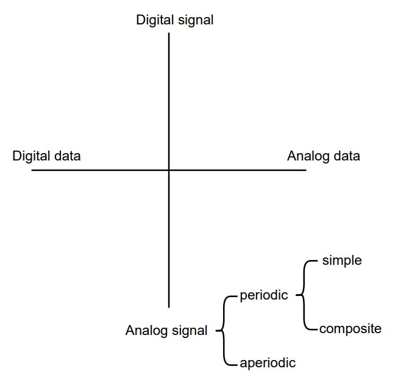
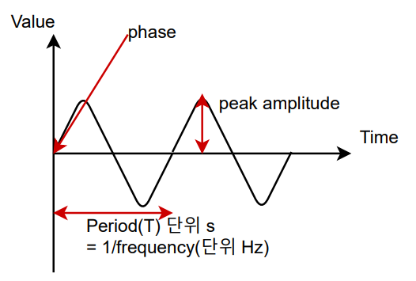
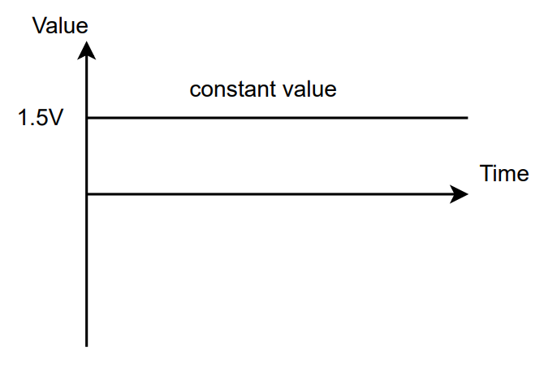
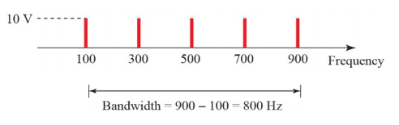

## [목차로](./readme.md)

# Introduction to Physical Layer

## data와 signal 구분
data는 전달하고자 하는 정보이고, signal은 (data를 실어나르는) 자연계의 현상. 빠르게 이동하는 특성이 있음. data가 있으면 signal이고 없으면 그냥 noise.

data -> analog or digital

signal -> analog or digital

## signal 종류
analog or digital

periodic <-> aperiodic // analog, digital 구분 없음.




# periodic analog signals
`cycle`: the completion of one full pattern 

- simple 
> sine 파 같은거. 더 simpler한 signal로 분해가 불가능 함.

- composite
> 여러개의 sine파로 구성되어 있음.


## Sine wave
the most fundamental form of `a periodic analog signal`.



x축 `Time`임. sine파는 `진폭 amplitude`, `주기(주파수) period(frequency)`, `위상 phase`의 3가지 요소로 이루어져 있음.

 

이런 일정한 값도 sine 파의 한 종류로 볼 수 있음. `period`를 매우 크게 늘린 것.

참고로 `period`의 단위는 `s`이고, `frequendy`의 단위는 `Hz`이다. 둘의 관계는 역수.

```
seconds       s   1s
miliseconds   ms  10^-3s
microseconds  µs  10^-6s
nanoseconds   ns  10^-9s
picoseconds   ps  10^-12s
```

## Phase
`time=0`일때의 파형(waveform)의 위치. `θ`

```
a sine wave is offset 1/6 cycle with respect to time 0. what is its phase in degrees and radians?

1 complete cycle = 360°
phase in degree = 360° / 6 = 60°
phase in radian = 60 x 𝜋/180 rad = 𝜋/3 rad
```

## Wavelength
`파장`

wave가 공간에서 움직일 때, 한 파형이 공간에 나타나는 거리. x축을 거리로 해서 생각한 것.

`frequency`와 `속도 c`에 관련이 있음.

`wavelength` ∝ `1/f`x`c`


## Time and Frequency Domains
`x축`을 `time`으로 하거나 `frequency`로 하거나. composite analog signal인 경우에는 `frequency domain`으로 표현하면 보기 좋아짐.


[source](https://knowledge.ni.com/KnowledgeArticleDetails?id=kA03q000000YGJ7CAO&l=en-US)

## Composite Signals
simple sine wave를 여러개 모아서 만듦.

통신에서 쓰이는 analog signal은 당연히 aperiodic한 신호겠지

- a composite priodic signal


[source](http://www.myreadingroom.co.in/notes-and-studymaterial/68-dcn/714-composite-signals.html)

- a nonperiodic composite signal

무한대의 주파수 성분(sine waves)으로 분해가 됨.


[source](https://woodforest.tistory.com/50)


## Bandwidth
**단위: Hz**

주파수 띠의 너비.

bandwidth 내에서 어떤 주파수는 쓰이지 않을 수도 있음.


그림 보면 알겠지만, periodic composite signal은 이산적인 주파수 성분으로 분해가 되고, nonperiodic composite signal은 연속적인 주파수 성분으로 분해가 된다.

```
periodic signal이 5개의 sine wave로 나눠진다. 주파수 100Hz, 300Hz, 500Hz, 700Hz, 900Hz. 모든 주파수 성분이 10V의 amplitude를 가진다고 했을 때, spectrum을 그려봐라
bandwidth?: (900-100)Hz
```


```
example 3.15
한 cycle에 2개의 pixel를 전달할 수 있고, 총 초당 11,025,000픽셀을 전송해야 하는 경우.
초당 11025000/2 = 5,512,500 cycle가 필요하다. 즉 5,512,500Hz = 5.5125MHz의 bandwidth가 필요함.
```


# Digital Signals
> analog signal쓸지 digital signal쓸지는 뭐로 결정하냐? 주어진 매체(medium)이나 어떤 주파수를 받아들일 수 있는가에 따라서...

information은 analog signal뿐만 아니라 digital signal로도 나타내질 수 있다. 예를 들면. `1`: `+V`, `0`: `-V` 아니면 `0V`. 그리고 digital signal은 2개 이상의 level을 가질 수 있다. 그러면 각 level마다 1비트씩을 더 보낼 수 있다.


```
어떤 digital signal이 8개의 level을 가지고 있다. level마다 몇개의 bit가 필요한가?

Number of bits per level = log_2 (levels) = log_2(8) = 3;

어떤 digital signal이 9개의 level을 가지고 있다. level마다 몇개의 bit가 필요한가?
log_2(9) = 3.17인데 비트 개수는 정수여야 하므로, level마다 4비트가 표현될 수 있다. 물론 16개 중에서 7개는 못쓰겠지
```

## Bit rate
대부분의 digital signal은 nonperiodic이다. 

몇개의 **bit**(정보)가 초당 전송되는가: **bit rate (bps)**

몇개의 **symbol**(신호)가 초당 전송되는가: **baud rate (symbols/s**) d묵음임.

```
exmaple.3.18)
한 글자가 8bit이고, 1page에 24행, 80열의 글자가 있는 문서를 초당 100page를 다운받는다고 하자. bit rate?

100 x 24 x 80 x 8 = 1,536,000
따라서 1,536,000bps = 1.536 Mbps이다. 
```
```
exmaple 3.19)
voice channel은 analog voice signal의 4kHz bandwidth를 사용한다.
signal을 가장 높은 주파수의 2배로 sample한다고 했을 때, (각 샘플이 8비트를 요구한다고 함)
필요한 bit rate?

가장 높은 주파수의 2배로 sample하니까 
초당 생성되는 sample 수는 2 * 4k = 8000이다.
그리고 각 sampled 8 bit라고 했으니까 초당 비트 수는 8000 * 8 = 64000 bps이다.
bit rate = 64kbps
```

## Digital As Composite Analog
디지털 신호를 복합 아날로그 신호로 나타내는 것.

그러기 위해서는 analog 신호의 bandwidth가 무한대여야 함. 

왜냐하면 디지털 신호에서 수평인 부분은 `T=∞ => f=0`이고, 수직인 부분은 `T=0 => f=∞`이기 때문임.


그리고 전용 유선 라인은 사용할 수 있는 bandwidth가 무한대니까 거기서는 사용가능함. 무선통신에서는 자원이 한정되있어서 불가능할 듯.

## Transmission of Digital Signals
`Fourier analysis`에 따르면, digital signal은 composite analog signal임.

## low-pass = baseband
> baseband channel == lowpass channel; baseband signal == lowpass signal;

digital baseband transmission (= line coding)

highest frequency 밑의 주파수만 통과시키는 것임.


midium의 전체 bandwidth를 single channel이 쓰는 것(dedicated channel)의 예시는 LAN이다.


## Digital signal에 대한 analog signal로의 대략적인 계산
digital signal은 좋지만, 전송 매체가 무한히 넓은 대역폭을 지원해야 한다는 문제가 있음. 

low-pass channel에서) `N bit rate`를 전송할 때 필요한 `bandwidth = N/2`

 

이미지에서 보면 N=3인 digital signal를 8개의 analog 성분으로 분해했음. 가장 높은 주파수 N/2, 낮은 주파수 0이니까 bandwidth = N/2 Hz가 됐는데. 실제로는 이렇게 변환하지는 않음.

bit rate=N인 digital signal을 analog signal로 변환할 때 필요한 최소의 bandwidth=N/2 Hz임.

또, bandwidth를 더 넓게할수록 원래 digital signal의 모양도 잘 살아남. 이럴 때는 최소 bandwidth의 x3, x5를 하면 됨.

```
baseband transmission을 사용해서 1 Mbps를 전송하고 싶을 때, low-pass channel의 필요한 bandwidth?

low-pass channel을 사용한다는 것은 f=0인 것을 사용할 수 있다는 뜻임.
아무튼 위의 식에 의해서 최소 bandwidth를 계산하면
1M/2 = 0.5M. 따라서 500kHz이므로 사용가능한 주파수가 0부터 500kHz인 low-pass channel이 필요함.
```
```
bandwidth=100kHz인 low-pass channel이 있다. 이 channel의 최대 bitrate?

bitrate -> bandwidth는 최소를 물어보고
bandwidth -> bitrate는 최대를 물어봄.

암튼 N/2 = 100k니까, N = 200k. 따라서 200kbps이다.
```

## band-pass channel
주파수 f1, f2사이의 주파수만 통과시키는 channel

baseband transmission이 제일 좋은 통신인데 여러 이유로 그걸 사용하지 못하는 경우.

baseband transmission 불가능. `broadband transmission` 사용함


1. 매체 자체의 특성때문에 baseband transmission이 불가능함.
2. 현실적인 이유(무선 통신)때문에 baseband transmission이 불가능한 경우.


# Transmission impairment
장거리 통신(tele-로 시작하는 것들)에 문제가 발생할 수 있음.

`attenuation(신호가 작아지는거)`, `distortion(신호 왜곡)`, `noise(잡음)`

## Attenuation
: a loss of energy. 그러니까 단위는 `W`겠지. 손실된 파워니까

중간 지점에 `amplifier`를 달면 해결

```
어떤 signal이 통신매체를 지나서 power가 절반이 되었다고 하자.
P2 = 0.5P1. 이 경우에 attenuation(loss of power)를 구하시오

10xlog_10(P2/P1) = 10xlog_10(0.5) = 10x(log_10(5) - 1) = 10 x (-0.3) = -3 dB.(dB는 단위가 아니라 표현법임)

attenuation: 3dB
```
참고 dB계산
```
x10     +10dB
x100    +20dB
x1/10   -10dB
x1/100  -20dB

x2      +3dB
x3      +6dB
x8      +9dB
x1/2    -3dB
x1/4    -6dB
```
```
amplifier를 통해서 power가 10배가 되었다. 이때의 amplification(gain of power)?

P2 = 10P1

10xlog_10(P2/P1) = 10xlog_10(10) = 10 dB
```
```
Example 3.29
dB에 단위를 붙여서 쓸 수 있다. dB_m: milliwatts로 power를 표현한 것.;
10xlog_10(k*P/1mW) = k dBm;

log_10(P_m) = -3이라고 하면, P_m = 10^-3mW이 되고, dB_m단위로는 -30dBm이 됨.
```
```
example 3.30
loss in a cable: -0.3dB/km이고, 첫 시작지점에서의 power=2mW일때, 5km지점에서의 신호의 power?

5km까지의 loss in the cable = 5 x (-0.3) = -1.5dB임.
파워 손실 계산하면
10log_10(P2/P1) = -1.5dB. 이니까 
(P2/P1) = 10^-0.15 = 0.71
P2 = 0.71xP1 = 0.7 x 2mW = 1.4 mW
```

## Distortion
signal의 form이나 shape가 변형된다는 것. 또 composite에서는 각 신호마다 delay가 생길 수도 있음.

## Noise
impulse noise같은 것. 잡음.


### SNR
Signal to Noise Ratio; SNR_dB=`10log_10(Signal Power / Noise Power)`

SNR가 크다: 통신 잘됨; SNR가 작다: 통신 어려움; 그렇다고 해서 Signal power를 막 크게 할수는 없는 것임. 보통 SNR=10dB정도면 적당하다고 함(Signal power = Noise Power * 10)


만약 noiseless channel이면 SNR=무한대니까, 전송전력을 조금만 줘도 통신이 가능함.

```
power of a signal = 10mW, power of the noise = 1 microW; SNR? SNR_dB?

SNR = (10000 microW)/(1 microW) = 10000;
SNR_dB = 10log_10(10^4) = 40;
```

# Data rate limits
channel의 최대 전송 속도 **bps**

계산 방식: `Nyquist` for noiseless channel, `Shannon` for a noisy channel

## Nysquist Rate
For a noiseless channel.

`Bitrate = 2 x bandwidth x log_2(L)` L은 signal levels.

L=2일때, 위에 있는 baseband transmission의 approximation에 있는 것과 같아짐. bandwidth = N/2

이상적인 경우에 `bitrate`는 2가지 요소(`bandwidth`, `levels`)에 의해 결정됨. 무선통신의 경우에는 `bandwidth`를 넓히기 어려움. `level`수도 늘리기 어렵다? 왜?

```
exampled 3.34
bandwidth 3000Hz의 noiseless channel에서 2 signal level을 가진 signal을 전송할 때, 최대 bit rate?

2 x 3000 x log_2(2) = 6000
maximum bitrate = 6kbps
```
```
bandwidth 20kHz의 noiseless channel로 265kbps를 전송하려고 한다. level 몇개 필요한가

256k = 2 x 20k x log_2(L); log_2(L)=6.625;
L=7이면 bitrate=280kbps가 되고, L=6이면 bitrate=240kbps가 됨.
```

## Shannon Capacity
현실에서는 noiseless channel같은 것은 없어. 그래서 이거 사용함

`Capacity(bps) = bandwidth(Hz) x log_2(1 + SNR)`. SNR=Signal Power/Noise Power

`bandwidth`와 `채널품질 SNR`에 의해 영향을 받음.

```
SNR이 거의 0인 noisy channel이라고 하자. 그러면 capacity값은
capacity = B x log_2(1+SNR) = B x log_2(1) = 0;
```
```
example 3.38
전화선의 이론적인 최대 bitrate값을 계산하고자 한다.
bandwidth는 300Hz에서 3300Hz이고, SNR=3162이다.

C = Blog2(1+SNR) = 3000 x log2(1 + 3162) = 3000 x 11.62 = 34,860bps
```
SNR값이 데시벨(dB)로 주어질 때가 있다. 그러면 환산해야하는데 귀찮다. `SNR=10^(SNRdb/10)`

그렇지만 SNRdB값으로 대략적인 capacity를 구하는 공식이 있다. `C ~= B x SNRdB/3`
```
SNRdb = 36, bandwidth = 2MHz일때 capacity?

2M x (36/3) = 24M
따라서 capacity는 대략 24Mbps
```

## Using both limits (nyquist, shannon)
shannon 식에서는 signal level에 대한 항목이 없음. 단점. 예를들어서 bitrate와 bandwidth가 주어졌을 때, 가능한 signal level수를 구할 수가 없음.
```
1MHz bandwidth 채널이 있고, 이 채널의 SNR=63이다. 적절한 bitrate와 signal level?

우선 shannon식을 적용하면 capacity = 1M x log2(1+63) = 1M x 6 = 6Mbps; 답 쓸때는 계산 따로 단위 따로

이 값으로 bitrate의 상한값(upper limit)를 알아냈다. 이제 이 값을 가지고 nyquist를 적용해서 적절한 level 정하면 된다.

6Mbps보다 작은 값 중에서 계산 쉬운걸로 예를들어서 4Mbps를 골랐다.
4Mbps = 2 x 1M x log2L = 2 x log2L; 따라서 L=4이다.
```

# Performance
네트워크의 성능의 요소
## Bandwidth
bandwidth라는 용어는 맥락에 따라서 frequency band `Hz`를 나타낼 수도 bit rate `bps`를 나타낼 수도 있다.
## Throughput
네트워크를 통해서 실제 데이터 전송되는 속도 `bps`
```
bandwidth=10Mbps의 네트워크는 평균 분당 12000 frame밖에 전송할 수 없다. 그리고 각 frame는 평균 10000 bits이다. 이 네트워크의 throughput?

실제 전송 속도 물어본 것이니까, 10000 * 12000/60 = 2M;
2Mbps이다. 
```

## Latency (delay)
source에서 첫 bit가 나온 순간부터 destination에 전체 message가 전달 될때까지의 시간

`latency = propagation time(물리적 신호전달) + transmission time(전송시간) + queueing time + processing delay`

## Bandwidth-Delay Product
link의 성능 지표로써 bandwidth와 delay는 중요하다.

`bandwidth x delay`를 하면 channel안에서 움직일 수 있는 총 bit를 구할 수 있다. 근데 그냥 그렇다하는 개념만 알아둬라

## Jitter
같은 간격으로 data(packet)을 전송할 경우에 각 packet이 경험하는 delay라고 하는데 이것도 정확한 정의는 아니라고 하네


## [목차로](./readme.md)