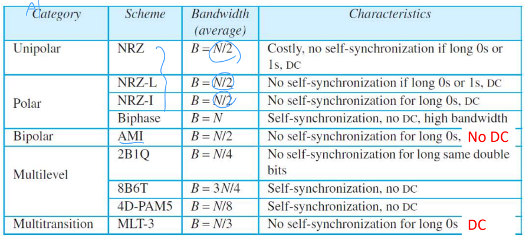

## [목차로](./readme.md)

# 요약
- Unipolar
```
NRZ: 1에 +, 0에 0
r=1, Bmin=Savg=c N/r = N/2

전력소모 커서 안씀

Baseline wandering: o
DC components: o
Self-syncronization: x
```
- Polar
```
NRZ-L: 1에 +, 0에 -
NRZ-I: next bit가 0이면 유지, 1이면 전 비트의 반전

r=1, Savg=N/2

power는 NRZ보다 작음

Baseline wandering: o
DC components: o
Self-syncronization: x


RZ: 0에 rising edge, 1에 falling edge. 근데 각 신호끝은 0으로 감.

r=1/2(edge표현하려면 두개 symbol써야함), Savg=N;

Baseline wandering: o
DC components: o
Self-syncronization: o
Complexity high 
high signal rate and bandwidth


biphase: 
Manchester: 0에 falling edge, 1에 rising edge. 각 edge는 +, -극으로 감.
Differential Manchester: 다음 비트가 1이면 유지, 0이면 inversion.

이더넷, NFC, RFID에 쓰임.

r=1/2, Savg=N;

Baseline wandering: x
DC components: x
Self-syncronization: o
high signal rate and bandwidth
```
- Bipolar
```
AMI(alternating mark inversion): 0에 0, 1에 이전 0아닌 값의 반전
Pseudoternary: 1에 0, 0에 이전 0아닌 값의 반전

r=1, Savg=N/2

NRZ의 대안. 장거리 통신에 사용됨.

Baseline wandering: x?
DC components: x
Self-syncronization: x
same signar rate as NRZ

```
- Multilevel
```
2B1Q: 2개의 비트를 1개의 symbol로, 4개의 level를 가져서 전송

r=2, Savg=N/4

DSL에서 사용됨.

Baseline wandering: o
DC components: o
Self-syncronization: x //1개의 symbol만 쓰니까


8B6T: 8개의 비트를 6개의 symbol로 3개의 level를 가져서 전송

r=8/6=4/3, Savg=N3/8;

reduntdant한 signal pattern을 이용해서 안좋은점을 보완

Baseline wandering: x
DC components: x
Self-syncronization: o


4D-PAM5: 패턴을 잘라서 여러 라인으로 전송함.
5개의 레벨인데 0V는 에러탐지로 쓰이기만 함.

r=2?

기가비트 이더넷
Baseline wandering: x
DC components: x
Self-syncronization: o
error-detection
```
- Multitransition
```
MLT-3: level=3, r=1
다음 비트가 0이면, 이전레벨 유지;
다음 비트가 1이고 현재 레벨이 0이 아니면, 다음레벨=0;
다음 비트가 1이고 현재 레벨이 0이이면, 다음레벨은 마지막 nonzero레벨의 반전;

그러니까 1일때만 움직임.

worst case의 signal rate = N/4임.

Baseline wandering: x
DC components: o
Self-syncronization: x
```


# Digital Information -> Digital Signal

3가지 기법이 동반됨: line coding, block coding, scrambling

# 일단 알아 둬야할 것.
`data element`= `bit`, `signal element`=`symbol`

`r` = 한 signal에 몇개 data전송하는가 = `data element`/`signal element`

Signal rate `S`(`baud`) = Data rate `N` (`bps`) / `r`;

Signal rate `S`는 작을수록 좋고, Data rate `N`는 클수록 좋음. 그러니까 `r`이 큰 값일 수록 Signal rate `S`는 작아지니까 좋음.

Bandwidth (`Hz`)는 Signal rate `S`에 영향을 받음. 

최소로 필요로 하는 `B`는 `S` = `c*N/r`에 비례함. 주어진 Bandwidth `B`에서의 최대 Data rate `N`은 `r*B/c`에 비례함. 여기서 `c`는 channel factor라고 했던가 보통 `1/2`이고 아무튼 주어지는 값임.

사용되는 `power`는 `V^2`에 비례함. 

# Line Coding

## 피해야 할 것
### Baseline wadering
수신측에서 signal volatage의 평균으로 baseline을 정의해서 signal을 해석함.

그런데 길게 연속된 0이나 1이 있으면 baseline을 움직이게 해서 decode를 올바르게 못함.

### DC components
frequency=0인 지점에서 amplitude가 0이 아닌 경우에 발생함.

전송 channel이 low-pass가 아니면 신호가 못지나감. 

그리고 DC component가 있다는 말은 추가적인 전력소모가 생긴하는 것임. 비효율적.

### Complexity

## 추구해야 할 것
### Self-syncronization
수신자와 송신자의 clock을 맞춰야 적절하게 bit를 해석할 수 있음. 그것을 위해서는 rising edge나 falling edge가 필요함.

근데 또 edge가 많으면 Signal rate가 높아지니까 대역폭이 늘어나는 문제가 있음. 디지털 신호에서는 대역폭 늘어나는게 큰 문제는 아니라고?

### Built-in error detection
### Immunity to noise and interference

## Line Coding Schemas
### Unipolar
NRZ
### Polar
NRZ, RZ, biphase
### Bipolar
AMI
### Multilevel
2B/1Q, 8B/6T, 4D-PAM5
### Multitransition
MLT-3

`Unipolar`, `Polar`, `Bipolar`는 전부 다 `Level=2`임.

## Unipolar
극성 1개: (0, +V)이거나 (0, -V)이거나

### NRZ
모든 signal level이 한쪽에만 있음.

```
1 0 1 1 0 
+ 0 + + 0
```

Non Return to Zero의 약자. 현재는 전력 비효율성으로 안씀.

Normalized power = 절반은 +V, 절반은 0으로 간다고 생각해서 계산함. = `V^2*1/2 + 0^2 * 1/2` = `V^2 * 1/2`

power는 V의 제곱에 비례하니까..


## Polar
극성 2개: (-V/2, +V/2)사용

### NRZ-L(level)
현재 비트가 `0`이면 `+V/2`, `1`이면 `-V/2` // 그러니까 일반 NRZ에서 -V/2씩 한거라고 생각하면 비슷함.

```
0 1 0 0 1 1 1 0
+ - + + - - - +
```

### NRZ-I(inversion)
이거는 initial level(첫 신호)가 뭐였는지에 대한 정보가 필요함.

다음 비트가 `1`이면 `반전`, `0`이면 `유지`

```
0 1 0 0 1 1 1 0
+ - - - + - + +
```

**공통특성**
`r=1`, `S_average = N/2` (c=1/2라고 했을때)

power = `(V/2)^2 * 1/2 + (-V/2)^2 * 1/2` = `V^2/4`

- 단점

baseline wandering 존재함. NRZ-L에서는 2배 더 심함

synchronization 문제 존재함.

f=0일때 power density가 매우 높다. => DC-component가 있다.

- 장점

Bandwidth가 N/2밖에 안된다. // 어차피 구리선으로 통신하는데 이게 왜필요하냐? -> signal rate 계산하려고??? 뭔가 말이 안맞는데? 아무튼 좋은거라고 하자

Signal rate가 N/2밖에 안된다.

**예제**
```
NRZ-I를 사용해서 1Mbps data를 전송한다. average signal rate하고 minimum bandwidth?

Bmin 비례 Savg = c * N/r;

NRZ계열은 r=1임. 여기서 c=1/2라고 주어짐.

그러니까 1M/2 = 500k니까, Savg = 500k baud이고 Bmin = 500kHz이다.
```


### RZ
time 간격의 절반이 될 때, `zero`로 되돌아 감.

```
   0    1    0    0    1
|-V 0|+V 0|-V 0|-V 0|+V 0|...
```

`r = 1/2`, `Savg = N` (c=1/2일떄)

- 장점

Self-synchronization: symbol 사이에 0으로 가는 edge가 존재하니까

- 단점

DC component 존재: 0000..이 전달되면 baseline이 -V/2로 되니까 f=0인데 amp!=0이 아닌게 생김. 

level이 3개나 필요하다 -> 복잡해서 안쓰임

높은 Signal rate `S`


### biphase
1비트에 2개 phase가 있음. Manchaster방식과 Differential Manchester 방식이 있음.

```
Manchaster

   0     1     0     0
|+V -V|-V +V|+V -V|+V -V|

Differential Manchester 
// NRZ-I하고 비슷함.
// 다음 비트가 1이면 유지, 0이면 반전
```

`r=1/2`, `Savg = N`

- 장점

No baseline wandering

self-syncronization

- 단점

Signal rate와 bandwidth가 NRZ의 2배이다(`N`)


## Bipolar
(0, +, -) 값을 사용함.

어떤 데이터면 Amp=0V, 다른 데이터면 Amp값을 바꿈. 

### AMI: Alternating Mark
여기는 data=0일 때, amp=0. data=1이면 이전의 1일때의 값의 다른 값.
```
0 1 0 0 1 0
0 + 0 0 - 0
```

### Pseudoternary
data=1일때, amp=0.
```
0 1 0 0 1 0
+ 0 - + 0 -
```
`r=1`, `Save=N/2`

NRZ의 대안으로 개발됨.

NRZ와 같은 `S_avg`값 (`N/2`). 게다가 DC component가 없음.(f=0일때 amp=0이니까)

주로 장거리 통신에 쓰임.

- 장점

Signal rate가 적다. NRZ와 같은 값.

DC component가 없다.

- 단점

Syncronization problem.


## Multilevel
level>2인 경우임: symbol 하나에 bit 여러개: r>1

`mBnL`로 표현함. `m`개의 Bit를 `n`개의 symbol로 표현하는데, `L`개의 level을 사용한다. 여기서 `L`은 n=2개면 B, n=3개이면 T, n=4개면 Q 이런식임.

이때 L을 선택하는 조건은 `2^m <= L^n`.(전달할 신호 종류 <= symbol과 level로 표현 가능한 수)

`r=m/n`이겠지. 그러면 `S = cN/r = 1/2 * n * N / m`

### 2B1Q
2개의 bit를 1개의 symbol로 나타내고 level 개수는 4개이다.

`r=2`: 1개의 symbol에 2개 bit 나타내니까. `Save = N/4`

Signal rate가 줄어서 비용은 절감했지만, complexity는 증가했음.

(A)DSL에서 사용됨.

### 8B6T
8개의 bit를 6개의 symbol로 나타내고 level 개수는 3개이다.

전달할 신호 수: 2^8 = 256; 표현 가능한 수: 3^6 = 729;

473개의 안쓰이는 signal pattern이 존재한다. 그래서 이 중에서 Line coding에 좋은 특성을 갖는 것으로만 골라서 사용하는거다.

- 장점

Syncronization

error detection: reduntant signal을 받으면 이게 error라는 것을 알게 됨.

DC balance -> DC component 줄이는거: 어케함? +가 하나 더 많은 패턴을 사용한다고 할 때 inversion한 것도 사용하면 그거는 -가 하나 더 많게되고 그러면 전체적으로 봤을 때 0으로 균형이 맞춰짐.

100Mbps Ethernet에서 쓰임

### 4D-PAM5

8개의 bit를 4개의 signal과 4개의 level로 나타냄.

`r=2`, `Savg = N/4`...이어야 할텐데 왜 S=500MBd(baud)라고하지? 아무튼간에

giga ethernet에서 사용됨.

한 패턴을 잘라서 여러 라인으로 전송함. 여기서는 4개의 라인으로 전송함.

giga ethernet이면 N=1Gbps 가 사용됨. 이 큰 데이터를 125MBd를 지원하는 4개의 선으로 나눠서 보냄

## Multitransition
### MLT-3
signal rate 를 낮추기 위한 방법임. -> bandwidth 절약

```
if nextbit==0: nextLevel=currentLevel
if nextbit==1 and currentLevel != 0: nextLevel=0
if nextbit==1 and currentLevel = 0: nextLevel = ~(last nonzero level)
```

**worst case**

1111로 된 값을 전송하게 되면, `+ 0 - 0 + 0 - ...`이런식으로 됨. 그러면 4비트가 한 파형으로 볼수도 있음. 이 경우에 `S=N/4`

## 요약



# Bit의 Block Coding
syncronization과 error detecting을 위해 redundancy가 필요함. 그걸 제공해줌.

line coding의 성능을 향상시킴.

일반적으로 하는 일이 뭐냐? `m bit`의 블록(기존의 line coding의 input)을 `n bit`의 블록으로 바꿈 (`n > m`). `mB/nB` 인코딩 기법으로도 불림.

어떻게 함? multilevel line coder에서처럼 redundant level을 많이 만들어 냄.
```
기존:
data -> | Line Coder | ->    // 동기화나 에러감지등의 단점

Block Coding:
data -> | Block Coder | -> | Line Coder | -> // 단점 보완
```

## 4B/5B encoder with NRZ-I
NRZ-I는 00000...에서 synchronization 문제가 있음. 그래서 4B/5B block coder가 3개 이상의 연속된 0을 만들어 내지 않게 함.

mapping table이 있고, control sequence도 있음. table에 없는 sequence를 받으면 error로 판단함. 

- 단점

Signal rate는 5/4배(120%)가 됨.

DC component 문제는 여전히 있음.

```
Example 4.5
1Mbps로 data를 보내고 싶다. 4B/5B with NRZ-I를 쓰거나 Manchester coding을 사용했을 때 bandwidth의 필요한 최소값은?

4B/5B를 쓰면 bitrate는 1.25Mbps로 증가한다. NRZ-I에서의 최소 bandwidth=N/2=625kHz임.

Manchester를 사용하면 S_avg=N이라서 최소 bandwidth = N = 1MHz임.

전자는 bandwidth 가 작지만 dc component가 존재하고, 후자는 bandwidth가 크지만 dc component가 없다. 
```

## 8B/10B block encoder
4B/5B보다 error detection capability가 크다. (여기서는 2^10-2^8만큼 있으니까)

그대로 구현하려면 2^8의 table가 필요하므로 mapping table의 크기를 줄이기 위하여 5B/6B, 3B/4B 두개로 나눠서 작업한다.

기가비트 이더넷, pcie, hdmi, usb3.0에서 쓴다.


# Scrambling
얘도 line coding의 단점을 보완하는 것임. Block coder(bits->bits)와는 다르게 input/output이 symbol임.

장거리 통신에 부적합한 경우에:

- Biphase(Manchester, ...) - 넓은 bandwidth를 사용해서 불리함

- Block coding + NRZ - DC component를 사용해서 조금 그럼;;

- Bipolar AMI - input=000..이면 신호도 그냥 0이라서 sync하기 어려움

이러한 단점들을 극복하기 위한 solution에는 다음 것들이 필요하다:

- bit 수를 늘리는 것(bandwidth 넓히는 것)은 싫다 -> block coding 싫다

- synchronization을 제공해야한다

결론: `bipolar AMI`에서 synchronization 문제만 해결해서 사용하자. long zero-level pulse를 scamble로 어떻게 할 것임.

`B8ZS`와 `HDB3`이 있는데 두 방식은 하는게 동일하고 다만 유럽식/미국식 차이 그런 것임. 그래서 하나만 설명함.

## B8ZS
`bipolar AMI` line coder의 결과에서 연속된 8개의 0을 `000VB0VB`로 바꿈.

`V`: violate: AMI rule를 violate해라. `B`: balance: 이전 `V`값의 반대

왜 violate함? 정상적인 신호가 아니라 `00000000`을 교체한 것이라고 표시해두는 것임.


```
연속된 0 이전에 +인 경우:
원래 패턴: 1 0 0 0 0 0 0 0 0
교체 패턴:   0 0 0 V B 0 V B
바꾼 패턴: + 0 0 0 + - 0 - + 
첫 V는 이전 마지막 0이 아닌 값이 +였으니까 violate해서 +이고,
첫 B는 첫V에 대해 balance하니까 -로 가고
두번째 V는 마지막 0이 아닌 값이 -였고, violate해서 -이고,
두번째 B는 두번째 V에 대해 balance하니까 +로 감. 

연속된 0 이전에 -인 경우:
원래 패턴: 1 0 0 0 0 0 0 0 0
교체 패턴:   0 0 0 V B 0 V B
바꾼 패턴: - 0 0 0 - + 0 + - 
```


## [목차로](./readme.md)