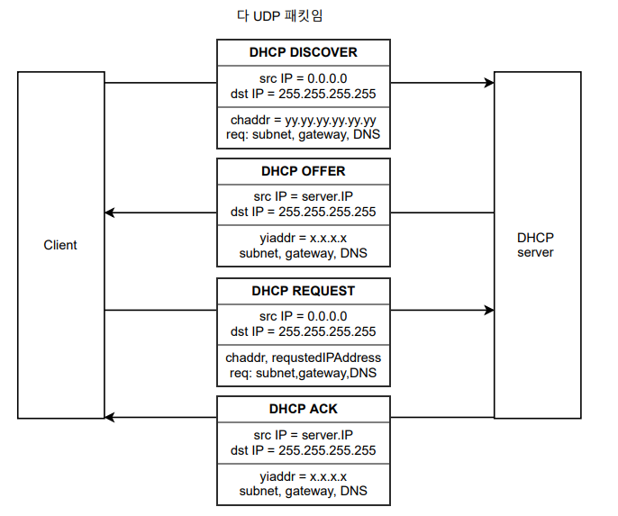
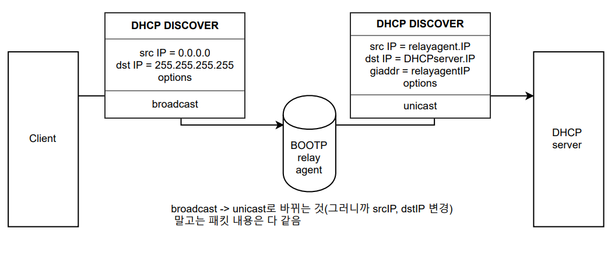

## [목차로](./readme.md)


1. 단어의 정확한 정의가 무엇인가
2. 해당 프로토콜, 기술이 나온 이유가 무엇인가 (Motivation)
기존의 BOOTP가 비효율적이라서. host에 네트워크주소 할당. DHCP 서버에서 호스트로 설정 파라미터 전달
3. 해당 프로토콜, 기술이 어떻게 작동하는가


IPv4 설명하면서 IP통신에 필요한 4가지(IP, 서브넷 마스크, 기본 게이트웨이, DNS서버)를 받음(옵션 설정했으면). 기본은 동적 IP 할당

# DHCP
Dynamic Host Configuration Protocol

IP, 서브넷 마스크, 임대시간 등을 알려줌

DHCP는 네트워크 관리자가 IP주소의 할당을 중앙에서 관리하고 자동화하게 해줌.

자동할당(영구적), 동적할당(대여기간), 수동할당의 방법이 있음. 이 중에서 `동적할당`이 많이 쓰임.


기존의 BOOTP는 static하게 설정함. 그리고 2단계로 이루어짐.
반면에 DHCP는 dynamic하게 ip할당이 가능. 1단계


## 설계 목표
- 로컬 관리자가 정책을 제어 가능해야함
- 클라이언트는 수동 사전 설정이 필요가 없음
- 네트워크도 개별 클라이언트에 대해 수동 사전 설정이 없음.
- DHCP는 각 서브넷에 서버를 필요로하지 않는다. -> 스케일과 경제성. `라우터 넘어서도 작동 가능: relay agent 이용함. 아래 BOOTP내용과는 관계 없음.`
- DHCP는 BOOTP 릴레이 에이전트하고도 상호 동작해야한다.
- 클라이언트는 요청에 대해 여러개의 응답을 받을 준비가 되있어야 한다.

## DHCP 요구사항
- unique한 네트워크 주소 보장
- client가 재시작해도 그 client의 설정을 가지고 있어야 함
- 새로운 client에 자동화된 (설정 파라미터) 할당. 그러니까 알아서 해줘야 한다고
- 특정 client에게는 고정된 할당 허용(automatic allocation(이거 위에서 영구적인 할당이라고 했었음. dynamic하고 다른점), manual allocation)


# DHCP HOW
```
간단한 버전
DHCP client            DHCP Server
      discover ----->       // 내 ip줘
      <------------ offer   // 이거 어떰
      request ------->      // ㅇㅇ 나 이거 쓸래
      <------- acknowledge  // ㅇㅋ

왜 이런 여러 단계를 거치냐? DHCP server가 여러개인 경우가 있어서 client가 선택한 것을 다시 request로 보내주는 것임.
```

# DHCP 구성요소
- DHCP Server
> IP pool 들고있고 할당해주는 얘
- DHCP Client
> 나, host
- DHCP relay agent

## BOOTP relay agent
맨 처음에 client가 `discover`던질 때, dest ip를 broadcast로 보냄(255.255.255.255)

근데 내 subnet 안에 DHCP Server가 없어 ip받으려면 다른 subnet로 가야해. 근데 broatcast 패킷은 라우터 너머로 못가. 그러면 나는 어디서 ip받아와야해?

이래서 BOOTP relay agent가 나옴. 이 릴레이 에이전트는 라우터에 설치됨. 만약 DHCP 패킷이 나가야 하는 상황이 생기면, relay agent는 이 패킷을 `unicast`로 변환하고 DHCP서버로 보냄. 이 과정에서 받은 패킷의 `giaddr(relay agent ip)`가 0이면 라우터가 이 패킷을 받은 인터페이스의 ip(쉽게말하면 자신의 ip)를 적음. 0이 아니면 손대면 안돼. **giaddr가 broadcast이면 절대 안됨**

DHCP server에서 다시 client로 보낼 때는, 우선 server가 `unicast`로 client가 속한 라우터에 패킷을 보내고, 라우터에서 `broadcast`로 변환해서 보냄.

```
        same subnet
-------------------------------
DHCP     <-broadcast->       DHCP
client                       Server
--------------------------------


이 그림에서 router에 BOOTP relay agent가 있음.
      subnet 1          subnet 2
-------------------------------------------|
|      broadcast->     |    unicast->    DHCP
DHCP                router               Server
client  <-broadcast    |    <-unicast      |
--------------------------------------------
```


## DHCP message format (header)
op: 1 = BOOTREQUEST, 2 = BOOTREPLY

hops: relay agent에서 쓰임

ciaddr(client ip addr): `client ip address` 첫 할당에는 `0.0.0.0`. 재갱신할때는 내 IP

yiaddr(your ip addr): `서버`에서 보내줄 때, 너 주소 이거 쓸래?/써라. client의 ip

siaddr: 특정 DHCP 서버 지정. 중요도 낮은 듯

giaddr: `BOOTP relay agent` IP address

chaddr(client hw addr): client의 MAC

`options`: 이거 중요함. 왜냐하면 여기 값으로 1,3,6주면 각각 `서브넷 마스크`, `라우터 IP(기본 게이트웨이)`, `DNS IP` 넘겨주거든.

## 너는 프로토콜 뭐쓰니
UDP쓴다.

이말은 적어도 DHCP서버는 4계층(transport layer)이상 있다는 거겠지

## relay agent 추가 설명
원래 source ip=0.0.0.0인 패킷은 illegal IP source라고 해서 버리도록 설계 되어있음(Martin address filtering). 아마 이거는 Network layer에서 하는 일이겠지?

근데 BOOTP relay agent를 지원하는 호스트나 라우터는 DHCP패킷의 헤더의 op 코드가 BOOTREQUEST인 것(그러니까 BOOTREQUEST메시지)의 sourceip=0.0.0.0인 것은 안버려. 


## DHCP protocol 설명들
1. 각 클라이언트는 `DHCPDISCOVER`메시지를 서브넷에 브로드캐스트로 보냄. 이게 서브넷에 서버가 있는지 없는지에 따라서 BOOTP relay agent가 념겨줄 수도 안넘길수도 있음.

2. 각 서버는 `DHCPDISCOVER`메시지를 받으면, 사용 가능한 네트워크 주소를 `yiaddr`필드에 적어서 그리고 options에 맞는 값들도 적어서 `DHCPOFFER` 메시지를 보냄.

다음 순서로 주소를 선택함

- client의 지금 주소가 지금 사용중인 경우(임대 시간 연장)
- client의 이전 주소가 만료돼서 썼던거 다시 주는 경우(물론 서버의 주소 풀에서 사용가능해야함)
- 메시지에서 `Requested IP Address`옵션에 주소가 있고, 그게 사용가능한 경우
- 서버의 가능한 ip 풀에서 하나 할당(서브넷에 맞게끔 줌)

서버는 DHCPOFFER로 제공한 ip를 예약해둘 필요가 없음. 그래서 나중에 request받을 때 사용중인지 확인해봐야 함.


3. 서버에서 `DHCPOFFER`를 보낼 때, 필요하면 BOOTP relay agent 사용함.

보통 `DHCPOFFER`, `DHCPACK`, `DHCPNAK`를 보낼 때, client로 `unicast`로 보낸다고 함. 근데 맨 IP할당되지 않은 경우에는 내 ip가 없는데 `unicast`로 보낼 수 없잖아? 그런 경우에는 미리 `DHCPDISVOER`메시지에서 `BROADCAST bit`를 `1`로 설정 해놓고 보낸대. 이 경우에는 `broadcast`로 보내줌.

4. 클라이언트가 나 이거 쓸래. `DHCPREQUEST`보냄

5. 서버가 ㅇㅋ `DHCPACK` 안되면 `DHCPNACK`. ip할당하거나 임대 갱신하거나. 참고로 임대갱신으로 `DHCPDISCOVER`는 임대시간의 50%가 지났을 때 `unicast`(갱신할때는 서버ip 아니까)로 보낸대

DHCP서버는 `DHCPREQUEST` 패킷을 받는다. `DHCPREQUEST`에서 선택된 서버는 하나밖에 없겠지. 선택된 서버는 `DHCPACK`나 `DHCPNACK`를 전달한다. 이 패킷에서 선택되지 않은 서버들은 `아.. client가 내 DHCPOFFER 거절했구나..`라고 처리한다.

6. 클라이언트는 `DHCPACK`메시지를 받는다. 옵션에서 설정했으면 서브넷 마스크, 기본 게이트웨이, DNS서버도 받음. `DHCPACK`패킷 내의 `임대시간`을 확인해야함.

클라이언트는 ARP같은 것으로 마지막 체크를 수행함. 그러면 할당 완료.


- `DHCPRELEASE` 임대시간보다 일찍 사용이 끝났어. 그래서 나 이제 이거 그만 쓸래하고 client가 보내는 것. `unicast`겠지

- `DHCPINFORM` client가 server로 로컬 파라미터만 요청하는 것. 네트워크 주소는 외부적으로 마친 상태. (이거 별로 안중요한 것 같음)


## 정리 (새로 할당받는 경우)
1. client `broadcast` `DHCPDISCOVER` `source ip = 0.0.0.0`
2. server respond `DHCPOFFER`
3. client `broadcast` `DHCPREQUEST` `source ip = 0.0.0.0`
4. server accept, `DHCPACK`


## DHCP 장점
1. IP설정의 중앙화된 관리 Centralized administration of IP configuration
2. 동적 host 설정 Dynamic host configuration
3. 매끄러운 IP host 설정  Seamless IP host configuration
4. flexibility and scalability

## DHCP 단점
- DHCP 서버가 다운되면, client는 조직의 네트워크에 접근할 수 없음.
- UDP를 사용하므로 통신이 안전하지 않고 안정성이 떨어진다.
- machine name이 새로운 ip주소 받을 때 바뀌지 않는다? 이거 뭔말이야

### 보안 문제: 

인증 없는 프로토콜이야

메시지에 대한 검증 없음.

DHCP서버에 새 ip주소 계속 내놔하면서 공격 가능함. 서버 부하, ip pool고갈

누구나 dhcp 서버처럼 행동할 수 있음 -> dns spoofing

### DNS spoofing:
DHCP 요청하면서 옵션에 따라서 dns서버도 받는다고 했다

근데 attacker가 dhcp서버처럼 행동하면서 다른 값은 정상으로 주는데 이상한 dns로 정해줌.

그 이상한 dns서버에서 패킷 감청할 수 있음.





## 왜 DHCPREQUEST에서 unicast가 아닌 broadcast를 사용하는가
이게 왜 궁금했냐?  시험에도 안나올 거 같은데... 그야... 궁금하니까지

DHCPOFFER에서 DHCP server ip를 알아왔는데 그 다음에 내가 이 ip쓸래라고 보내는데 왜 broadcast로 보내는지 궁금했음.

우선 DHCPDISVOER는 broadcast로 보내기 때문에 주변의 DHCP server에게 `ip 줘`라는 메시지가 다 갔음.

메시지를 받은 각 server에서 DHCPOFFER를 보냈음. 그리고 client로부터의 DHCPREQUEST 응답을 기다리고 있음. 

즉 이 상태에서 client는 DHCPOFFER메시지가 여러개 있는 상태고 이 중에서 한개 골라야 함. 하나 골라서 이제 보내야하는데, 나를 기다리고 있는 server가 많아. 그래서 걔네들한테도 알 수 있게 broadcast로 보내는 것임. 대신 여기에서 Message Payload의 DHCP Server Identifier(option 54)에 DHCP server ip가 들어감.

DHCPREQUEST를 받은 여러 서버들은 DHCP Message Payload를 까보면서 DHCP Server Identifier(option 54)값이 내 ip하고 다르네? 하면 `내 offer는 버려졌구나`라고 생각하는거고, 내 ip하고 같네? 하면 `내 offer선택했구나`하고 생각하고 `DHCPACK`아니면 `DHCPNACK`를 다시 client로 보냄. 여기는 아직 client의 ip가 없으니까 broadcast로 보냄.


## [목차로](./readme.md)