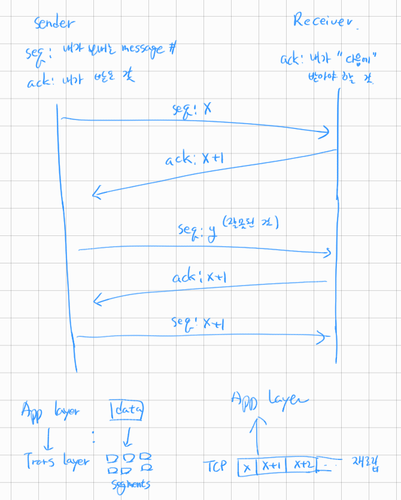

## [목차로](./readme.md)

# OSI 7 Layer
```
OSI 7 layer
Application layer
Persentation layer
Session layer
Transport layer
Network layer
Datalink layer
Physical layer

TCP/IP stack
Application layer(OSI 7에서 위에 3개 합쳐서)
Transport layer
Network layer
Datalink layer
Physical layer
```

Top-down으로 데이터를 보애는데 각 단계에서 해더를 붙여서 내림

## 강의 목표
- 메세지가 인터넷을 통해 전달되는 방식
- 각 프로토콜 layer의 목적이 무엇인가
- 위 목적을 이루기 위해서 각 프로토콜이 어떻게 자동하는가

# Application Layer
`네트워크를 거쳐서 데이터를 수/발신하는 플랫폼을 제공한다.`

end system에서만 존재함

최상위 계층임. 사용자에게 보이고, 사용자와 직접 상호작용 할 수 있는 계층.

예시) 인터넷 브라우저, 이메일 클라이언트

# Presentation Layer
`네트워크나 application을 위해서 데이터를 representataion 한다`

data를 `application format`에서 `network format`으로 변환하거나 그 반대로 변환한다.

예시) 데이터 암/복호화. 문자 인코딩, 데이터 압축

# Session Layer
`사용자 application (process와 response) 사이의 세션을 열고, 닫고, 관리한다.`

그냥 세션(end-to-end 일회용인 논리적인 연결) 관리한다.

호스트 사이에 첫 연결을 만들고, 정해진 시간 내에 데이터를 주고 받을 수 있게 해준다.

예시) VoIP

## 주요 기능들
- Dialog control
> 두 시스템이 dialog에 참여하도록 허용하고, 누가 전송해야 할 차례인지 추적?한다.
- Syncronization
> 데이터의 stream에 체크 포인트(동기화 지점)를 추가한다.

## 기능들
- 연결 맺고 끊기
> 세션을 만든다는 것은 논리적인 연결을 맺는다는 것과 동일하다.<br>
> 그 과정에서 세션을 유지하기 위해서는 세션키를 공유하는데 세션이 많아지면 서버 관리, 확장이 어려워짐<br>


위 문제점을 해결하기 위해 나온 것이 토큰.

token을 이용해서 stateless한 상태로 session layer가 dialog를 관리할 수 있음. 이거는 Message header에 SIP라는 태그로 존재함.

- Multiplexing
> 이거는 Transport layer에서의 multiplexing하고도 관련 있음.<br>
> 여러개의 세션 연결을 하나의 transport layer connection으로 묶는 것(하향식). 아니면 그 반대(상향식)도 하던가

- Error correction
> session layer는 전송중에 sync points(동기화지점)을 삽입하면서 message를 conversation으로 그룹한다.<br>
> 에처가 발생하면 interrupt된 conversation unit의 처음부터 전송을 재개한다.


# Transport layer
`process to process에서 메시지의 전송을 책임진다.`

어떤 네트워크가 쓰이든간에 투명하고 신뢰가능한 통신을 해주는 layer이다.

예시) TCP, UDP

## TCP
Connection oriented Transmission

1. 수신자(dst)는 패킷를 받은 뒤에 송신자(src)에게 ACK(acknoledgement)패킷을 보낸다.
2. 이런 종류의 전송을 `reliable transport method` 라고도 한다.
3. ACK패킷처럼 메시지 이외의 패킷을 더 보내므로 느린 전송 방식으로 여겨진다.
4. 보낸 데이터에 문제가 발생하면, 수신자는 (받았고 알아볼 수 있는 패킷을 알리면서)재전송을 요구한다.
5. 수신자(dst)가 모든 데이터를 받았고, `패킷을 재조립`할 필요가 있다면, transport layer에서 올바른 순서로 데이터를 조립하고 상위 계층인 session layer로 전송한다.



## UDP
Connectionless Transmission

1. 수신자는 패킷의 수신여부를 알리지 않는다. (ACK패킷 없음)
2. 송신자는 패킷이 잘 도착한다고 `가정`한다.
3. 이런 접근법은 통신이 빠르도록 해준다.
4. 그 대신에 TCP보다는 신뢰성이 부족하다.


## 시험준비할때는 transport layer에서 다음 5가지를 기억해라
1. Connection management
2. Connection multiplexing
3. Segmentation
4. Reliable and unreliable data delivery
5. Flow control and Congestion Control


## Connection Management
두개의 device사이의 연결을 맺고 유지한다.

디바이스 사이에 물리적으로 연결 된 것처럼 virtual circuit를 구성한다.

전형적인 예시로는 TCP connection `TCP 3-way handshaking`이 있다.
```
Sender                  Receiver
1.   SYN packet ---->
2.    <------ ACK + SYN packet
3.   ACK packet ---->
.
. 이후로는 위에 그림처럼 데이터 전송 시작함.
```
이 과정으로 TCP connection 맺어진다.

```
session layer -> session 맺음
transport layer -> connection 맺음
session하고 connection하고 무슨 차이인데

크롬 앱을 열만 하나의 session이 맺어지고
그 안에서 탭 하나하나가 connection임

connection 구분은 (src ip, src port, dst ip, dst port)으로 함

TCP header에는 src port, dst port가 있음.
```


구글 크롬같은 통신 프로그램이 실행될 때, transport layer으로부터 서비스 제공을 위해 미리 포트(자원)를 할당한다.

만약 포트가 할당되지 않으면 크롬은 실행되지 않는다. 세션이 맺어지지 않는다는 말이겠지

이때 양방향 세션이 맺어지지 않으면 데이터는 application으로 전송되지 않는다.

## Multiplexing
`하나의 TCP를 통해서 여러개의 Application에 전달하는 것`

여러개의 applications가 동시에 데이터를 주고 받을 수 있도록 하는 기술

각 App마다 포트를 할당하는데(Connection Management 참고) 그 포트 번호를 이용해서 가상의 채널을 통해 통신함.

예를 들자면 여러개의 App이 하나의 TCP연결을 사용하는데 그 App을 구분하는데에 포트번호를 사용한다.

그러면 여기서 Transport layer(kernal space)하고 Application layer(user space)는 어떻게 통신하느냐? socket으로 통신함. Socket은 연결을 위한 소프트웨어적인 개념임. socket은 application이 TCP/IP 네트워크에 연결할 수 있도록 해줌.
```
12.34.2.1:10378 -> App1  
12.34.2.1:23432 -> App2
12.34.2.1:54382 -> App3
데이터 전송할 때도 마찬가지로 포트번호를 사용해서 구분함
```

## Segmentation
`bit stream`으로 오는 데이터를 Network layer로 보내기 위해서 MSS크기 만큼 `segment`로 데이터로 나누는 것

Application으로부터 받은 data를 segments로 나눠서 Network layer로 전달함.

IP가 알려주는 `Max Segment Size(MSS)`를 기준으로 segment로 나누고 각 TCP`헤더`를 붙임.

나누는데 딱히 문맥을 따지지는 않음.

segment 다 받으면 합쳐서 session layer로 올림(TCP 참고)
```
데이터 단위
Tranport: segment - segmentation - MSS
Network: packet or datagram - fragmentation - MTU
Datalink: frame

TCP는 byte(8bit) stream 단위로 보내고 받음
IP는 패킷, 데이터그램 단위로 보내고 받음

TCP의 바이트 스트림으로 보내줄 수 없으니까 뭉쳐서 IP로 보내줌.

UDP는 datagram 단위로 메시지를 보냄. 그래서 따로 쪼갤 필요 없이 그냥 header 붙이고 보냄
UDP header에는 payload length라는게 있는데 **datagram의 헤더 포함 전체 크기**를 말하는 것임. 16비트 값.
그래서 UDP datagram의 전체 크기는 2^16=65536바이트인데, 이 중에서 데이터의 크기만 계산하면
65536 - {UDP header size=8byte} = 65527 bytes임. 
그렇지만 아래 계층 Network layer를 생각해보면 
이대로 가려면 IP header가 있으니까 65536 초과함. 그래서 20byte를 더 뺌.
그러면 실제 가능한 데이터 크기는 65507 bytes임. 

이제 전송을 한다고 하면, IP의 fragmentation이 필요한 부분임
연결된 인터페이스가 이더넷이라 하면 MTU=1500이니까 각 데이터그램을 1500바이트씩 나눠야 전송할 수 있음. 
그러면 각 나눠진 데이터그램의 크기는 최대 1480bytes임. 왜냐면 20바이트는 IP header가 먹으니까
```

```
MTU, MSS비교

MTU: Network layer에서 쓰임. Maximum transmission unit
MSS: Transport layer에서 쓰임. Maximum segment size

계산
MTU: IP Header(20 bytes) + Data(TCP segment)
근데 또 MTU는 datalink layer에서 인터페이스 정하고 나면 정해지는 것임.
MSS: MTU - {IP Header(20bytes) + TCP Header(20bytes)}

종합하자면 Transport layer에서의 MSS는 Network layer에서 사용하기 위해 최대 packet 사이즈에 맞게 segment화 하기 위한 값이고
Network layer에서의 MTU는 Datalink layer에서 선택한 인터페이스를 사용하기 위해 최대 frame 사이즈에 맞게 packet크기를 조정하기 위한 값이다.

TCP Header 20~60bytes;
참고로 UDP Header는 8바이트임.

```

## Reliable transmission
`를 제공한다.`


상위 계층의 entity에게 신뢰할 수 있는 채널로 데이터가 전송된다는 것을 알려줌

reliable channel이면, 전송중에 변형되거나 손실되는 데이터 비트가 없다. 그리고 보낸 순서대로 도착한다.

이 서비스가 `TCP`가 인터넷 application에 제공하는 모델임. UDP는 reliable하지 않다고 했음.


## Flow control and Congestion Control
`두 방식 다 sender의 보내는 속도를 조절함. 그 이유가 다름. flow control은 receiver의 처리 속도가 늦어서, congestion control은 네트워크에 혼잡이 생겨서`


### Flow control 흐름 제어
전달하는 쪽(src)과 받는 쪽(dst) 사이의 데이터 처리 속도가 다름을 해결하는 기법
> receiver가 처리할 수 있는 속도보다 빠르게 보내지면 중간에 쌓이 버퍼가 비워지지 않아서 손실이 생긴다.<br>
> sender가 보내는 속도와 보내는 데이터의 크기를 조절한다.


### Congestion Control 혼잡 제어
전송하는 쪽의 데이터 전송 속도와 `네트워크의 처리 속도`가 다름을 해결하는 기법
> 한 라우터에 데이터가 몰리면(네트워크가 혼잡), Sender의 전송 속도를 줄인다.


# Network Layer - IP
**Addressing and Fragmentation**

`모든 Internet transport 프로토콜은 source host에서 destination host로 데이터를 나르기 위해 Internet Protocol(IP)를 사용한다.`

connectionless하고 데이터가 도착했다는 것을 보장해주지 않는다.(Best effort Delivery <-> end-to-end delivery). end-to-end delivery를 보장해주지 않는다.

Network Layer에는 Internet Protocol(IP)하나 밖에 없음.


- 하는 일

1. Internetworking
> 서로 다른 네트워크 사이의 internetworking을 제공하는 것
2. Logical Addressing
> 많은 수의 다른 네트워크를 하나로 묶은 것이라서 각각의 장치를 식별할 수 있어야 함.<br>
> addressing schema(ipv4, ipv6)를 정의해서 각각의 device를 universally unique하게 식별할 수 있음.
3. `Routing`
> 이거 중요함<br>
> 라우팅을 통해서 패킷을 src에서 dst까지 보내는 path(host to host)를 정하는 것<br>
> src와 dst사이에 많은 라우터가 존재하는데 어느 경로로 갈지 정함.<br>
> 라우팅 테이블에는 어떤 network interface로 나갈지도 정해져 있음. <br>
> <br>
> 참고) hop to hop(router to router) 전달은 datalink layer에서 함.


# Datalink Layer
`hop-to-hop delivery`

`direct하게 연결된 네트워크에서 통신하기 위해...(To communicate on its directly-connected network)`

데이터의 신뢰성 있는 node to node(hop to hop)통신을 책임짐.

네트워크 인터페이스를 이용해서 물리, 논리적 연결을 다룸.

network layer에서 보낸 데이터 packet을 네트워크 인터페이스의 physical address(MAC)과 체크섬(CRC)을 추가해서 `frame`로 바꿈.

각 인터페이스에는 하나의 ip가 할당됨.
```
얘는 앞뒤로 데이터가 추가됨.
frame = [header | IP packet | CRC]
```

datalink layer는 physical layer를 통해 노드끼리 data frame의 error-free한 전송을 제공하기 때문에,
`상위 계층에서는 전송이 error-free하다는 가정`을 할 수 있게 됨.

- Flow Control
> Transport layer의 TCP에 있는 것하고 동일하지만 scope차이임<br>
> transport layer에서는 process to process사이의 flow control이라서 더 복잡한데<br>
> datalink layer에서는 hop-to-hop(router to router) 간의 flow control이라서 비교적 단순함. 예- 재전송해라 등<br> 
- Error Control
> CRC코드를 통해서 error 감지와 정정을 함.


# Physical layer
`물리 매체를 통해서 구조화되지 않은 raw bit stream의 전송,수신과 관련됨`

segment, packet, datagram, frame 그런거 없음. 010100010110....

뭐... 전기신호라던가, 광신호이라던가, 무선신호이라던가...

근데 이거는 컴공에서 할 일은 아닌듯


# OSI 7 Layer의 장점
- 한 계층의 변화가 다른 계층에 영향을 주지 않는다.
> 그치만 완전히 독립적이지는 않음. 왜냐 서로 데이터 주고받아야하니까
- 상업적 표준화를 이뤄낼 수 있다
- 네트워크 과정을 작은 요소로 쪼갰기 때문에, 소프트웨어 개발, 디자인, 문제해결을 쉽게 할 수 있다.
- 표준화가 되어서 여러 공급업체의 개발이 가능
- 다양한 종류의 네트워크끼리 통신 가능
- 네트워크에 문제가 생겼을 때, 해당 레이어만 보면 되니까 네트워크 관리가 쉬워진다.
- 배우기 쉬워진다.


## [목차로](./readme.md)