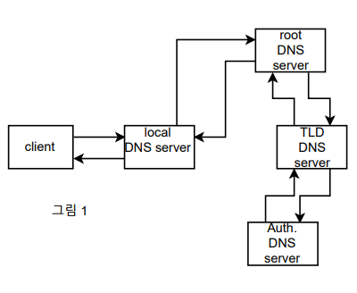
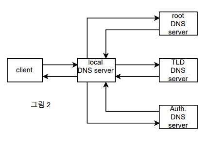
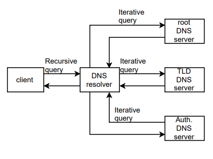

## [목차로](./readme.md)

1. 단어의 정확한 정의가 무엇인가
2. 해당 프로토콜, 기술이 나온 이유가 무엇인가 (Motivation)
3. 해당 프로토콜, 기술이 어떻게 작동하는가

# DNS (Domain Name System)


작동 방식에 recursive한 것과 iterative한 게 있다.

## 하는 일이 뭐냐
인터넷이 모든 것을 이름으로 부르는데 그 이름에서 주소로 변환해주는 것. mapping a domain name to an ip address

사람은 숫자로 된 주소보다 이름이 더 편하고, 컴퓨터는 이름보다 숫자가 더 편해. 그래서 그거를 DNS로 매핑해서 쓰는거지

DNS서버는 전역분산되어 있어서 global하게 찾음. 물론 DNS 데이터가 로컬에 캐시되서 성능향상에 도움이 될 수 있음.

DNS는 계층적임. 중앙 관리 방식이 아니라 관리가 공유? 분산됨. 그 관리의 분산이 delegation이라고 함

# DNS 구성요소
- Domain name space
- Name server
- resolver

## Domain name space
도메인을 서브도메인으로 나누는거. 도메인은 트리로 나타내짐. leaf domain은 하나의 호스트거나 회사(여러개 호스트 있는)를 나타냄. 최상위 도메인은 generic하고, 국가도메인임.

korea.ac.kr이면 kr -> ac -> korea

## DNS name server
`domain namespace 정보를 가지고 있는 server`

웹 서버와 웹 클라이언트는 숫자로 된 IP주소로 통신함. 근데 우리는 문자열로 된 주소로 쓰니까 그거를 변환해주는게 필요함. `domain namespace의 트리 구조`에 대한 정보가 필요하고, 그거를 가지고 있는 서버가 `name server`임.

Primary와 Secondary로 있고, secondary는 primary server가 다운될 경우를 대비해서 항상 primary의 정보와 동기화하고 있음.

## resolver
end user와 dns name server의 통신 사이에 있는 proxy? 중재자? intermediary agent?


## 구조
label name과 domain name으로 있음.

label name은 `.`으로 구분되어 있는 각 이름

domain name은 전체 이름
```
rose.first.co.kr <- 이거 전체가 domain name
                <- rose, first, co, kr가 각각 label name

rose: 이름이 rose인 host
first: 회사명
co: 회사 도메인을 의미
kr: 최상위 국가 도메인
```

## Fully Qualified Domain Name (FQDN) 전체 주소 도메인 네임
test1.korea.ac.kr에서

test1이 host 이름,  korea와 co가 (kr의 sub)domain, kr가 top-level domain

FQDN은 그냥 host + domain인데 그냥 전체 주소임: test1.korea.ac.kr

# DNS 작동 방식
client는 OS의 resolver(DNS resolver)를 사용해서 IP주소를 찾는다.

1. `client1`가 `resolver`에 `recursive DNS query`를 만든다. `http://someurl`에 맞는 ip주소 줘
2. `resolver`는 자신의 `DNS record cache`에 FQDN(full qualified domain name)(전체 주소 도메인 네임)이 있는지 찾아본다. 못찾으면 cache miss. 그러니까 이전에 같은 것으로 찾은게 있냐고
3. cache miss가 났으니까, `DNS name server` 여러개에게 `iterative query`를 날린다.
4. 여러개의 `DNS name server`가 `http://someurl`에 대한 DNS record를 respond해준다.
5. `resolver`는 `DNS record cache`에 `http://someurl`에 대한 DNS record를 추가한다. TTL(만료 시간 값)도 같이 넣는다. 이 시간 지나면 해당 캐시는 사라짐
6. `resolver`는 `http://someurl`에 대한 IP주소를 `client1`한테 respond한다.

7. `client2`가 `resolver`에게 `http://someurl`에 대한 IP주소를 요청한다. (FQDN에 대해 recursive DNS request날림)
8. `resolver`는 해당 FQDN이 있는지 자기 캐시를 찾아본다. 아까 client1줄때 만들었었고, TTL이 0이 아니니까 이거 그대로 넘겨주면 됨. DNS name server와 통신할 필요 없음. 빠름
9. `resolver`는 `http://someurl`에 대한 IP주소를 `client2`한테 respond한다.


# Recursive vs Iterative query

## recursive
recursive query에 대한 대답은 response임


개념적으로만 이렇다는거지 실제로 이렇게 하지는 않을거야



## iterative
iterative query에 대한 대답은 내 서버에 FQDN에 대한 ip가 없으면 referral임. 있으면 response임.




## 실제 통신



# Delegation
DNS의 장점 중 하나.

DNS 서버 관리를 분산시켜놓음. 이 것을 delegation이라고 부른다.

확장성이 좋다 이말이야


# DNS Protocol Message Format

UDP 또는 TCP 사용함. 53포트

UDP는 512바이트로 패킷 크기 제한이 있어서 response message가 512바이트보다 작은 경우에 사용. 나머지는 TCP 사용.

UDP가 속도는 더 빠르겠지

```
RD 필드: recursion desired: 1이면 recursive하게 처리해줘
RA 필드: recursion available: 0이면 (해당 name server가) 나 recursive한 처리 지원 안하는데
```


## [목차로](./readme.md)