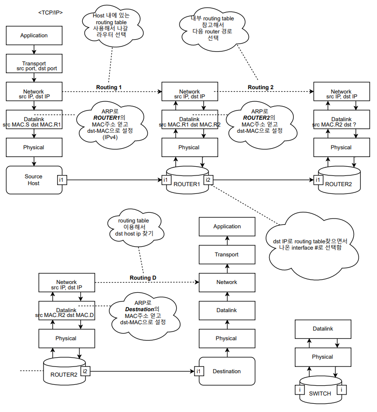

# 20212R-Computer-Network-COSE342-01
2021 2학기 컴퓨터 네트워크 

정리노트

내가 이해하기 쉬운 말로 비공식적인 언어로 정리함


# 목차

[0. Internet Architecture](./0.md)

[1. OSI 7 Layer](./1.md)

[2. IPv4만, Identity, Identifier and Address](./2.md)

[3. DHCP](./3.md)

[4. DNS](./4.md)

[5. IP](./5.md)

[Updating...](./)





```
중간고사 일정 - 10/25 (월) 15:30 - 16:45

중간고사 범위

- CNv3_00_Internet_Architecture
- CNv3_01_OSI_7_Layer
- CNv3_02_Identifier_n_Address (Application and IPv4)
- CNv3_03_DHCP
- CNv3_04_DNS
- CNv3_05_IP

(IPv4이외의 Application부분도 안보고 02_Identifier과 solicited multicast 는 시험범위에서 제외하도록 하겠습니다. )  

```