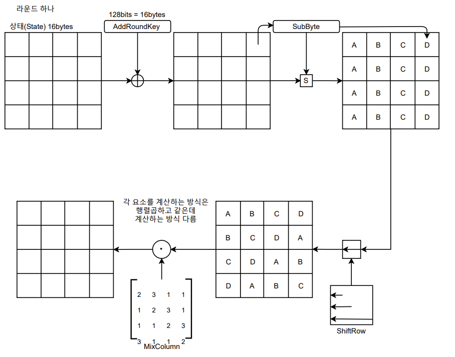
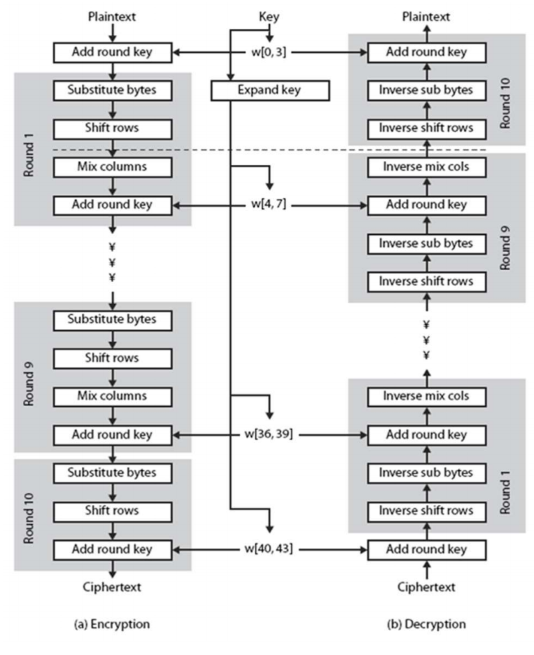

## [목차로](./readme.md)

# AES

## 소개

### 배경

DES는 키 개수가 2^56개 밖에 안돼서 브루트포스 공격 가능

triple-DES는 DES보다 안전하지만 느려서 별로. 또 키 개수고 2^112개 정도임. 나중에 털릴 수 있음.

블록암호인 DES의 블록 크기는 64비트인데 여러 응용 분야에 적합하지 않다고 하네

### AES 요구사항

블록 크기: 128비트

대칭키 암호

세 종류의 키(128비트, 192비트, 256비트)

소프트웨어와 하드웨어로 구현될 때 효율적이어야 한다

전수키 조사 외에 다른 암호 분석 공격에 강해야 함

## AES 구조
한 `블록 128비트 = 16바이트` // 128 = 8 * 16

비밀키 길이에 따라서 라운드 수가 달라짐: 128비트-10라운드, 192비트-12라운드, 256비트-14라운드

근데 일단 저 128비트, 192비트, 256비트는 마스터 키의 비트수고 각 `라운드의 키는 항상 128비트`임.

한 블록(`16바이트`)는 4x4행렬로 변환됨. 한 원소에 1 바이트. 이떄 이 `행렬을 상태(state)`라고 부름

한 라운드의 구성요소

- SubByte
> DES에서의 S-Box와 같음.<br>
> 바이트 단위로 치환(Substitution)<br>
> `혼돈(Confusion)` 구현
- ShiftRow
> 상태(행렬)의 한 `행안`에서 바이트 단위로 자리바꿈<br>
> `분산(Diffusion)` 구현 permutataion
- MixColumn
> 상태(행렬)의 한 `열안`에서 혼합이 수행<br>
> 원소 값은 0~3임 <br>
> `분산(Diffusion)` 구현 permutation
- AddRoundkey
> 비밀키에서 생성된 128비트(16바이트)의 라운드 키와 상태(행렬)을 XOR연산

shiftRow로 열 내에서 엇갈리게 만들고 mixcolumn으로 막 섞어


각 라운드를
round0 AddRoundkey

round1
- SubByte
- ShiftRow
- MixColumn
- AddRoundkey

...

로 볼지
round 0
- AddRoundkey
- SubByte
- ShiftRow
- MixColumn

round 1
- AddRoundkey
- SubByte
- ShiftRow
- MixColumn

...

로 볼지는 상관 없음



- 텍스트를 어떻게 상태(state)로 표현함?

아스키코드나 그런거 이용해서 한문자를 16진수로 표현함

그리고 위에서 아래로, 왼쪽에서 오른쪽으로 4x4행렬 채움


- SubByte

1바이트(8비트)를 입력받아서 `정해진 테이블`(고정된 값, 라운드키하고 상관 없음) 통해 1바이트(8비트) 출력

앞 4비트가 테이블의 행, 뒤 4비트가 테이블의 열 선택

- MixColumn

MixColumn에 대해 더 자세히 설명하자면 다항식으로 바꿔서 계산함.
```
[2 3 1 1] ⵙ [F3 30 72 41]^-1에서 첫번째 요소만 계산하면

[2 3 1 1]은 2진법으로 [10 11 01 01]이고 이거를 다항식으로 매핑함
[1*x+0*1 1*x+1*x 0*x+1*x 0*x+1*x] = [x x+1 1 1]

[F3 30 72 41]^-1은 2진법으로 [11110011 00110000 01110010 01000001]이고 이것도 다항식으로 매핑함
F3만 계산하면 x^7+x^6+x^5+x^4+x+1임

이때 2ⵙF3 값은
(2를 다항식으로 매핑한 것) * (F3을 다항식으로 매핑한 것)을 g(x) = x^8 + x^4 + x^4 + x + 1으로 나눈 것의 나머지 값임. 그걸 다시 이진법으로 나타내면 되겠지

여기서 g(x)는 고정된 값임

그리고 전체 값은 (2ⵙF3)^()^()^() 각각 XOR한 값임.

근데 실제 구현은 미리 계산해놓은 테이블이 존재함. 방식은 이렇다 이말이야
```

## 암호화 복호화
SPN 구조이기 때문에 복호화함수가 따로 존재한다. 각 라운드 함수의 역함수가 존재해야함

iterative이기 때문에 모든 component가 inversable해야 함

복호화에서 라운드 키는 DES처럼 역순으로 넣어줌

복호화 과정은 암호화 과정을 거꾸로 진행하면 됨

Feistel(DES)에서는 암호화 함수의 인풋만 바꾸고 라운드 키 거꾸로 넣어줬는데

여기서는 암호화 함수를 거꾸로 뒤집음 다만 복호화 함수가 따로 존재하야함. 각 함수의 inverse들




## 키 스케쥴 (또는 키 확장 key expansion)
128비트의 공유하는 마스터키로부터 `11`개의 `128비트` 라운드 키를 생성

AES에 128비트 키를 11번 사용하거든


## 안전성
취약키, 차분분석, 선형분석을 이용한 공격에 대해 안전함

Biclique암호분석? 2^126의 소요시간으로 줄어듦. 근데 이 공격은 데이터가 2^88비트가 필요해서 현실적으로는 불가능함.

현재로써는 안전함.

양자컴퓨터는...? 아직모른다

## 구현과 관련해서
DES와는 다르게 AES는 소프트웨어적으로도 효율적으로도 구현되도록 설계됨

DES와는 다르게 바이트 단위 연산을 함.

바이트 단위 연산을 하는 저사양 컴퓨터에서 효율적으로 설계 가능

요즘 인텔 cpu에는 하드웨어로 구현된 AES칩이 내장되어 있어서 매우 빠르게 계산 가능

AES는 DES보다 더 많은 하드웨어 자원을 요구한다고는 함


**알고리즘을 외울 필요는 없고 어떻게 그림 보고 데이터가 흘러가는가하고 어떤 컨셉으로 만들어 졌는가를 이해**


## [목차로](./readme.md)