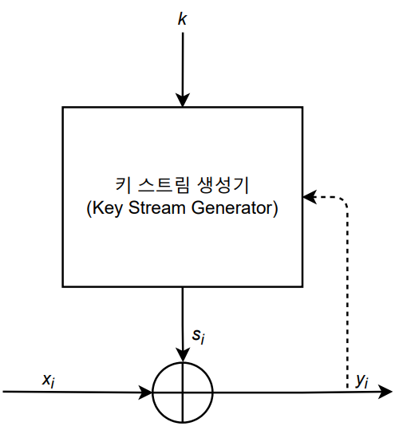

## [목차로](./readme.md)

# 운영모드 (Mode of Operation)

블록암호(DES:8byte, AES:16byte)를 사용하려 `다양한 크기의 데이터`를 암호화 하는 방식

현실 세계의 평문은 다양한 크기고 보통 블록 크기보다 훨씬 큰 데이터임

- ECB(Electronic codebook)
- CBC(Cipher bock chaining)
- CFB(Cipher feedback)
- OFB(Output feedback)
- CTR(Counter)

```
이 5가지의 운영모드를 볼때
1. 같은 평문에 대해 같은 암호문이 나오는가?
2. 병렬화가 가능한가?
3. 전송 중 에러비트가 발생하면 어떻게 되는가
4. 전송 중 손실이 일어나면 어떻게 되는가

이 4가지 측면에서 보기
```

# 패딩(Padding)
블록 Cipher의 경우 평문의 길이가 해당 블록 암호의 `블록 크기의 배수`가 되어야 함.

근데 현실은 그렇지 않으니까 블록 크기의 배수가 되도록 마지막 부분의 빈 공간을 채워서 완전한 블록으로 만듦

## 제로 패딩(Zero padding, Null padding)
단순하게 빈 공간을 `00`으로 채움 (1바이트를 16진수로 나타낸다고 할때)

> 문제점: 원본 메시지를 복원할 때, 만약 원본 메시지도 `00`으로 끝났다면 어디부터가 패딩인지 확인할 수 없음

## 비트 패딩(Bit padding)
빈 공간의 최상위 `비트`(MSB)에 2진수로 `1`을 할당하고 나머지는 `0`으로 채움.

바이트로 나타내면 1000(2)가 80(16)으로 나타남.

메시지 길이가 블록 크기의 배수일 때(그러니까 원본 메시지 길이가 딱 맞아도) 블록크기만큼 바이트 패딩을 진행함
> 왜? 패딩이 없으면 원본 메시지의 마지막 바이트를 패딩으로 오해할 수 있음

블록암호는 바이트 단위로 많이 쓰니까 블록암호에서는 잘 안쓰고 해시에서 잘 쓰인다고 하네

## 바이트 패딩(Byte padding)
빈 공간의 최하위 `바이트`에 `패딩된 바이트 수` 표시

메시지 길이가 블록 크기의 배수일 때(그러니까 원본 메시지 길이가 딱 맞아도) 블록크기만큼 바이트 패딩을 진행함
> 왜? 패딩이 없으면 원본 메시지의 마지막 바이트를 패딩으로 오해할 수 있음

예시) `3A FE 5A 00 00 00 00 05`

## PKCS7 패딩
패딩 `바이트` 크기(길이)을 패딩 값으로 사용함.

이것도 바이트 패딩처럼 원본 메시지 길이가 딱 맞아서 패딩할 필요가 없을 때에도 블록크기만큼 바이트패딩을 진행함

예시)   `... 97 64 64 06 06 06 06 06 06`

AES라면, `... 30 97 6F 20 | 10 10 10 10 10 10 10 10 10 10 10 10 10 10 10 10` 16진수라서 10(16) = 16임.


# ECB(Electronic codebook) 모드


`한 블록의 평문`은 `한 블록의 암호문`으로 암호화된다.

암호화: C_i = E_k(P_i);

복호화: P_i = D_k(C_i);

물론 여기서 P의 마지막 블록은 패딩된 상태임

## 장점
- 병렬처리가 가능
- 오류가 확산되지 않음
## 단점 
- 같은 평문에 대해 같은 암호문이 나옴.
- 블록 단위의 패턴이 유지됨.
> 암호문으로부터 평문 유추 가능
- 블록 재사용
> 암호 알고리즘 키를 몰라도 어떤 암호화된 값을 가지고 암호문을 수정해도 작동함 

## 암호문 스틸링 기법(Ciphertext stealing)
padding 없이 ECB모드로 암호화 하는 방법


평문의 마지막 두 블록을 이용함.

평문의 크기와 같은 크기의 암호문을 생성할 수 있음.

그림에서 블록크기가 10`비트`고 M이 8비트라 하면, Cn-1, Cn을 복호화 하는 방법은

```
0. Cn으로부터 몇 비트가 모자란지 알 수 있음. 2비트라는 걸 알아냄
1. Cn-1을 먼저 복호화함
2. 여기서 앞에서부터 8비트를 떼면 그게 Pn임. 남은 2비트를 Cn-1 뒤에 붙임
3. Cn-1하고 2비트 붙인걸 복호화하면 Pn-1 구함.
```

## 정리 
1. 같은 평문에 대해 같은 암호문이 나오는가?
> 네
2. 병렬화가 가능한가?
> 암호화, 복호화 모두 가능
3. 전송 중 에러비트가 발생하면 어떻게 되는가?
> Pi 전체 불가
4. 전송 중 손실이 일어나면 어떻게 되는가?
> Pi 전체 불가

# CBC(Cipher block chaining) 모드


하나의 `평문 블록`이 암호화 되기 전에 바로 앞 평문 블록의 `암호문과 XOR` -> `연결성(chaining)`. 평문의 블록 패턴이 암호문에서는 사라짐. 블록단위의 재사용 불가능

Initialization vector(IV)는 알려진 랜덤 값임. 이 과정을 거치지 않으면 두 암호 상황에서 P1이 같으면 C1도 같아짐. 송수신자 둘다 같은 값을 공유해야함. 이런 기능이 있는걸 `확률적 암호 알고리즘`이라고 함. 반대는 `결정적 암호 알고리즘` 예시 ECB

## 정리 
1. 같은 평문에 대해 같은 암호문이 나오는가?
> 아니요
2. 병렬화가 가능한가?
> 암호화는 병렬화 불가능. 앞 부분에서 암호화를 해서 넘겨줘야 새로 암호화를 할 수 있으니까<br>
> 복호화는 병렬화 가능. 역으로 연산을 하는데 그러면 XOR을 해야할 암호문들은 이미 다 가지고 있으니까
3. 전송 중 에러비트가 발생하면 어떻게 되는가?
>Ci의 한 비트에 오류가 발생했다고 가정하면<br>
>Pi는 복구 불가능. Pi+1은 Ci에서 에러비트가가 발생한 부분만 복원 불가능

4. 전송 중 손실이 일어나면 어떻게 되는가?
>Ci를 수신받지 못했다고 한다면<br>
>Pi와 Pi+1만 복구 불가능. Ci+1은 제대로 받지만 복호화에 Ci가 필요하니까 불가능함. Ci+2의 암호문부터 복구 가능함.


# CFB(Cipher feedback) 모드


암호화, 복호화 그림 살짝 다른거 확인해라. 그치만 함수는 같음



스트림 암호에서 잘 쓰이나봐.

**CFB, OFB, CTR모드는 스트림 암호를 만들기 위해서 사용함. 블록단위보다 같거나 작은 단위(r<=n)로 암호화를 함**

```
암호화 함수의 input은 n비트(블록 크기)임
평문과 암호문은 r비트임(위 설명대로 블록크기보다 작은 단위로 암호화를 함)

0. 처음 단계의 암호화함수의 register는 IV로 초기화 됨. 그 output(키 스트림)을 I1(r-bit)이라고 하자
1. C1 = P1 ^ I1(r-bit) // XOR연산
2. C1(r-bit)가 다시 암호화 함수의 입력으로 들어감
3. 암호화함수의 register가 입력된 r-bit만큼 왼쪽으로 shift됨
4. 변한 register에서 계산해서 output을 내보냄 I2
5. C2 = P2 ^ I2
6. 2~5단계 반복
```
```
복호화

0. 첫 단계의 암호화 함수(여기서는 복호화함수 따로 없음. 그냥 같아)의 register는 IV로 초기화. I1 생산
1. P1 = C1 ^ I1
2. 암호화 함수에 C1이 입력으로 들어감
3. register shift
4. I2 생산
5. P2 = C2 ^ I2
6. 2~5단계 반복
```

여기서 암호화함수의 입력으로 cipher가 들어가기 때문에 `cipher` feedback 모드라고 불림. 

복호화함수는 따로 필요 없는 구조임. 그냥 같은 IV 사용하고 입력값만 C로 바꾸면 됨.

여기서 다음 E_k에 들어가는 값은 이전 암호문의 전체가 아니라 MSB에서의 일부 비트만임.

암호화함수에 들어가서는 레지스터(n-bit)를 새로 들어온 것(r-bit)만큼 shift register에서 left shift시킴. 제일 처음은 IV겠지


## 정리 
1. 같은 평문에 대해 같은 암호문이 나오는가?
> 아뇨, P하고 S가 같아야하는데 그럴 확률이 적음
2. 병렬화가 가능한가?
> 암호화는 병렬화 불가능. Ci-1값이 있어야 Ci를 계산함<br>
> 복호화는 병렬화 가능. 복호화함수 따로 없음. 병렬로 IV, C1, C2, ... 이렇게 넣으면 S1, S2, S3, ... 병렬로 나오니까 각각 P1, P2, P3하고 XOR하면 됨.
3. 전송 중 에러비트가 발생하면 어떻게 되는가?
> Ci에서 에러비트가 발생했다고 하자<br>
> Pi에는 에러비트가 있는 부분을 제외하면 복원 가능함<br>
> Pi+1 복원 불가능 (지금 n==r을 가정한 상태임. 복호화함수에서 입력이 전부다 바뀌는 상황)<br>
> 일반화 하자면 Ci에서 에러비트가 발생했을 때, Pi는 에러비트빼고 복원 가능하고 Pi 이후부터 ceil(n/r)개만큼 복원 불가능함. 그 이후는 복원 가능<br>
> 오류 확산(Error Propagation)이라고 함. 근데 나중에는 오류 없어짐 - 이 현상을 자기 동기식(self-syncronizing)이라 함
4. 전송 중 손실이 일어나면 어떻게 되는가?
> Ci에서 손실있다고 하면<br>
> Pi 부터 P_i+ceil(n/r)개까지 복원이 불가능함. <br>
> (n=r 인 경우라면) Ci+1은 정상적으로 들어왔는데 그 사이에 shift register가 변하므로 Pi+2부터 복원이 가능 


# OFB(Output feedback) 모드

CFB에서 암호화함수의 입력으로 Cipher가 아닌 암호화 함수의 Output이 들어간 것

재밌는건 I(키 스트림)값이 P나 C의 영향을 받지 않음. 그래서 미리 I(키 스트림) 값을 계산해놓을 수 있음. 나중에 XOR연산만 하면 됨 -> 암호문에 독립적  <- 전처리가 가능하다

CFB모드처럼 복호화 함수가 필요 없음. 두개 같음

## 정리 
1. 같은 평문에 대해 같은 암호문이 나오는가?
> 아뇨
2. 병렬화가 가능한가?
> 암호화, 복호화 둘다 불가능
3. 전송 중 에러비트가 발생하면 어떻게 되는가?
> Ci에서 에러비트가 발생했다고 하자<br>
> 암호문에 독립적이라고 했으니까<br>
> Pi에서 에러비트가 발생한 곳만 불가능하고 다른 것들은 복원 가능<br>
> 에러 전이가 없음. 통신 환경이 안좋은 곳에 사용하기 좋음.
4. 전송 중 손실이 일어나면 어떻게 되는가?
> Ci에서 손실있다고 하면<br>
> Pi를 복구해야하는 곳에 Ci+1을 받아버리니까 <br>
> Pi를 포함해서 그 이후는 복호화가 불가능함. <br>
> 몇번째 블록인지 동기화해주는 것이 있으면 나머지는 복구 가능함.

# CTR(Counter) 모드

암호화: Ci = Pi ^ Ek(counter)

복호화: Pi = Ci ^ Ek(counter)

counter는 1씩 증가

CFB, OFB처럼 암호화함수와 복호화함수가 같음.

OFB처럼 I(키 스트림) 값이 독립적임. (암호문에 독립적) <- 전처리가 가능하다

위 두개와는 다르게 피드백을 사용하지 않음

## 정리 
1. 같은 평문에 대해 같은 암호문이 나오는가?(블록패턴유지)
> 아뇨
2. 병렬화가 가능한가?
> 예
3. 전송 중 에러비트가 발생하면 어떻게 되는가?
> Ci에서 에러비트가 발생했다고 하자<br>
> Pi에서 에러비트가 발생한 곳만 불가능하고 다른 것들은 복원 가능(오류 확산 x)
4. 전송 중 손실이 일어나면 어떻게 되는가?
> Ci에서 손실있다고 하면<br>
> Pi를 복구해야하는 곳에 Ci+1을 받아버리니까 <br>
> Pi를 포함해서 그 이후는 복호화가 불가능함. <br>
> 몇번째 블록인지 동기화해주는 것이 있으면 나머지는 복구 가능함.


## [목차로](./readme.md)