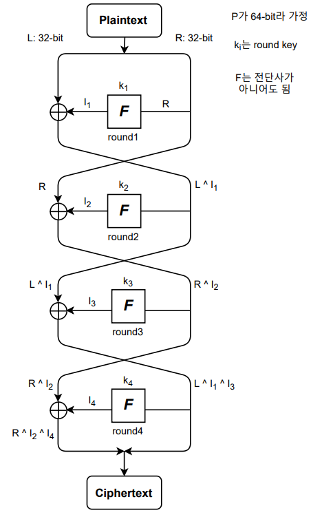
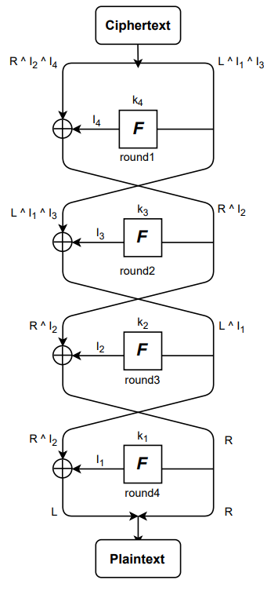
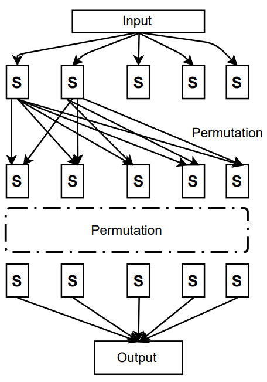

## [목차로](./readme.md)

# DES
Data Encryption Standard

현대 암호

왜 이렇게 설계되었는가라는거 말고 설계된 방식이나 작동 방식

(옛날) 전세계 표준으로 사용되었던 알고리즘

비밀키(대칭키) 암호임.

n-bit plaintext를 받아서 k-bit key를 이용해서 n-bit ciphertext를 만들어냄

# 비밀키 암호
1. 블록 암호
2. 스트림 암호
> 여기서는 다루지 않음


## 블록 암호
E(P, K) = E_K(P)로 표시 // key가 고정되면 후자로 사용

E_K: Z_2^n -> Z_2^n,   Z_2^n = {0, 1}

E_K는 전단사 함수이고 역함수(복호화함수)는 D_K

- 종류
1. Feistel Structure
> DES에 사용
2. SPN Structure
> AES에 사용

## Feistel Structure

그림은 4 round feistel structure


F(K_i, R_i) = I_i

- 블록 암호의 대표적인 구조
- L_i = R_(i-1), R_i = L_(i-1) ^ F(R_(i-1))
- SPN에 비해서 설계가 자유롭다
> 라운드 함수(F)가 역함수 존재하지 않아도 됨
- 라운드 함수(F)와 무관하게 복호화가 가능
- 구조적인 취약점 발견되지 않음
- 각 라운드 함수(F)는 취약한데(ch1에서 배운 고전함수같은거임.), 그걸 반복사용해서 강한 암호가 됨. 이거는 SPN도 비슷함.
- 암호화와 복호화 과정이 동일함
- 라운드 함수(F)는 동일함.

복호화

입력 거꾸로 두고 라운드 키 역순으로 함


// 참고 A^A=00..00, A ^ B ^ B = A


## SPN Structure
Substitution Permutation Network Structure


- 대치(Substitution)와 치환(Permutation)을 반복해서 안전한 암호 설계
- 뒤에 나오는 혼돈, 확산을 만족함
- 암호화와 복호화가 다름
- 각 라운드 함수를 만들 때 역함수를 고려해야함


# DES 소개
1973년 미 연방 표준

세계에서 가장 많이 사용되는 블록 암호

64비트의 데이터 블록을 사용하고, 56비트의 키를 사용한다.

키가 짧아서(2^56번 계산) brute-force 공격에 취약하다. 현재는 2^80정도의 계산이어야 안전하다고 함.

공격에 취약해서 현재는 3-DES(triple DES 그냥 DES 세번한거)나 AES사용함

## 혼돈(Confusion)과 확산(Diffusion)
블록 암호 설계를 위해 적용되는 **기본적인 원리**. 샤논(Shannon)이 제안
1. `혼돈(Confusion)`
> `키`와 암호문과의 관계를 감춤.<br>
> 키 예측을 불가능하게 함 <br>
> 현대 블록암호는 이것을 위해 `치환(Substitution)`을 사용함
2. `확산(Diffusion)`
> `평문`과 암호문과의 관계를 감춤<br>
> 평문과 암호문의 통계적 성질을 감추기 위함<br>
> 평문의 비트 하나가 변하면 암호문의 모든 비트가 변함<br>
> DES에서는 `순열(Permutation)`여러번 해서 만족함. AES에서는 `MixColumn`을 사용함.


- 곱 암호(Product Cipher)

샤논은 `혼돈`과 `확산`을 같이 사용해야 안전한 암호를 설계할 수 있다고 했음.

예를 들면 SPN구조에서 `치환과 순열`이 반복되는데 이거를 `라운드(Round)`라고 함.


- DES: 곱 암호의 형태임

**디자인 원칙: `S-box`**

조건
1. 한 비트가 다른 두 값이 S-Box에 입력되었을 때, 각 출력 값은 2비트 이상이 달라야 한다.
> 확산(Diiffusion)하고 관련된 것인 듯. 통계적 성질 감추는거
2. 하나의 S-Box에서 출력된 비트는 다음 라운드의 `모든` S-Box에 퍼져 들어갈 수 있도록 `순열`을 설계해야 한다.

참고: 블록 사이즈가 2^n비트인 곱 암호가 충분한 `혼돈과 확산`성질을 만족하려면 (n-1)라운드 이상을 가져야 함.

그림보면 S-Box에 permutation은 포함되지 않음. 그냥 대치(Substitution)만 하는 것인 듯. 치환(변환) 테이블이라고도 함

S-Box는 입력에 대해 출력은 이미 다 정해져 있음.


## DES 개요 및 상세구조
`64비트의 평문`을 `56비트의 키`로 암호화해서 `64비트의 암호문` 생성.

`16라운드` Feistel 구조

input 뒤에는 `IP(initial permutation`)이 있고 output 앞에는 `FP(final permutation)`이 있음 // 차분분석에 안전하게 하기 위해

56비트의 키(공유하는 비밀 정보)를 받아서 `키 스케쥴`을 통해서 각 라운드 함수(F)에 **48비트**의 라운드 키를 넘겨줌.

라운드 함수(F)는 R(32bit)와 K(48비트)를 받아서 32비트의 값을 출력함.

``` 
외울 필요는 없대 그림 보고 어떻게 작동하는지 이해하는 정도면 된대

왜 F랑 S-Box 왜이렇게 생겼대요? 차분분석도 대응할 수 있게 설계해놨대 근데 이것도 딱히 알 필요는 없을 듯


라운드 함수(F)의 구조에 대해 이야기하자면, 

32비트의 R을 받아오니까 그걸 4비트짜리 8개로 나눔.

라운드 키는 48비트라서 일단 R을 확장할 필요가 있음.

4비트짜리 8개로 나눈 R를 6비트짜리 8개로 확장함. 어떻게?
-> 뒤비트에서 하나 땡겨오고 앞비트에서 하나 땡겨옴
1011    1111 0100 0000 .... .... .... 0001 이면

1-1011-1 1-1111-0 1-0100-0 ...... ...... ...... .-0001-1 #실제로는 - 없음. 보기 좋으라고 추가한것

이렇게 확장한 R(48비트)을 라운드 키(48비트)하고 XOR연산을 함.

연산 결과를 6비트씩 나눠서 S-Box를 통해서 대치(Substitution)을 함. 이 결과는 각각 4비트씩임.

그대로 출력하면 양 옆에 비트만 영향을 주니까 잘 섞이지 않는 것임 그래서 치환을 함

나온 4비트짜리 8개를 치환(Permutation)(고정된 표가 있음)을 하고 그 결과(32비트)를 내줌
```

## Feistel 암호 구조
- Feistel 암호
> 가역요소와 비가역요소 모두 사용<br>
> 암호화와 복호화 과정이 동일함.
- Non-Feistel 암호
> 가역 요소만 사용

cf. 전단사 함수 f: X -> Y에 대하여 Y에서 X로의 역관계가 존재하면 이를 역함수(inverse function)이라 하며 f^-1: Y-> X로 나타낸다. 

가역함수는 역함수가 존재하는 전단사 함수를 의미한다.

- 2라운드 Feistel 구조는 1라운드 SPN 구조와 같은 안전성을 갖기 때문에 Feistel구조는 상대적으로 많은 라운드 수가 필요하다.... 왜지?


## DES 복호화
Feistel 구조이니까 입력 바꿔 넣고 키 순서 반대로 하면 복호화 됨

IP/FP는? 서로 역함수 관계라서 상관 없대

## DES 분석

### 취약키
- 취약키 4개
> E_k(E_k(P)) = P가 성립하는 key들
- 준 취약키 12개 (6쌍)
> E_k2(E_k1(P)) = P가 성립하는 key pair들
- 가능한 취약키 48개

전체 사용 가능한 키 2^56개인데 이 중에 취약,준취약,가능한취약키는 64개라서 사실상 확률은 매우 작음

### 전사적 공격(brute force attack)
하드웨어 성능 좋아져서 안전하지 않음

### 보수 특성(complemetation property)
**DES 나쁜 특징중 하나**

comp(0100) = 1011

Key Complement

C = E_k(P) => comp(C) = E_comp(k)(comp(P))가 성립함

따라서 공격 키 후보가 절반으로 줄어듦(2^56 -> 2^55)

### 차분 분석(differential cryptanalysis)
전수조사보다 빠름

통계적 특성(확률) 이용

분석하는데 필요한 데이터 2^47개

### 선형 분석(linear cryptanalysis)
그런게 있음

**아무튼 DES 안전하지 않다고 어떻게 할건데**

## 다중 DES
DES암호의 키 길이가 56비트 짧으니까 키 여러개 써서 DES 여러번 해보자

### 2중 DES
k1, k2니까 112비트겠지? 그러니까 2^112 연산이 필요하겠지? 두근두근

근데 실제 해보니까 그정도 까지는 아니래

```
P
M = E_k1(P)
C = E_k2(M)
```
이런 방식인데 그러면 P쪽에서 한번 암호화, C쪽에서 한번 복호화하면 M에서 만나야 할 것임. 그 때의 키 값이 우리가 찾는 것(**Meet-in-the-Middle Attack**)

메모리 2^56개, 연산량 2 * 2^56개 정도로만 키를 찾을 수 있음. 

2중 DES 의미 없네

### 3중 DES
```
3TDES 암호화
P
M1 = E_k1(P)
M2 = D_k2(M1) // 키 스케쥴 거꾸로 넣은 것
C = E_k1(M2) // 원래는 k3 쓰는데 [C = E_k3(M2)] k3로 하나 안하나 안전도는 2^112로 같음. 그러면 키 비트(168bit -> 112bit,, 56비트 절약) 아끼는게 낫지 

3TDES 복호화
C
M2 = D_k1(C)
M1 = E_k2(M2)
P = D_k1(M1)
```

Meet-in-the-middle attack하면 2^112정도의 안전도

기존 DES의 속도의 1/3임. 너무 느려서 못쓰겠다.

triple-des보다 빠르고 triple-des보다 비슷하거나 더 안전한 알고리즘 없나? 그래서 AES 개발됨


**데이터의 흐름하고 어떤 방식으로 만들어 지는 것을 이해하기. 알고리즘 자체를 외울 필요는 없음. 근데 그러면 어쩌라는거지**


## [목차로](./readme.md)