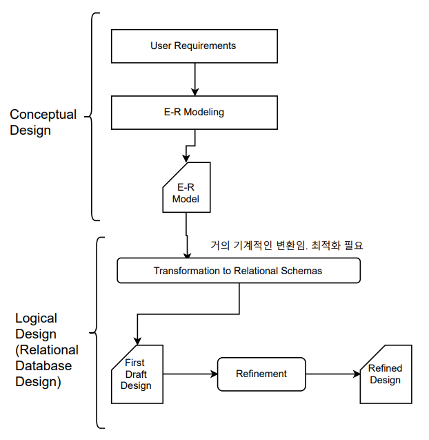
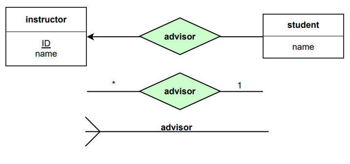

## [목차로](./)

# Database Degisn and E-R Model


# Systems Development Life Cycle(SDLC)
```
User Requirements Analysis ---------------+
                                          | 이 세 부분에서 업무과정에서 요구사항 분석
Information Requirements                  | ER modeling, Data model 검증 등을 하고
                                          | 이 단원에서 다루는 부분임
Conceptual Data Design -------------------+

Logical/Physical Database Design // relational algebra, mariadb같은 것으로

Database Implementation

Operational Database
```

## ER model 설계 절차

1. Identify entity sets
> 모든 가능한 entity set을 나열한다. 중복이나 그런거 생각하지 말고 다 나열함
2. Remove duplicate entity sets
> 각각의 entity set이 이름만 다른게 아니라 실제로 다른 것인가 확인. `system`을 entity set으로 포함하지 마.<br>
> library를 modeling한다고 하면 books, borrowers가 entity set이 될 수 있지 library가 entity set이 될 수는 없음.

3. List the attributes of each entity set
> 해당 entity가 application하고 관련 있는 모든 property들. <br>
> 진짜로 필요한건지 생각해봐. 다른 entity set에 있는 것이면 필요하지 않아
4. Mark the primary keys
> 어떤 attribute가 unique하게 instance를 골라낼 수 있을까<br>
> 어떤 weak entity set에서는 불가능할 수 있음.

5. Define the relationship sets
> 각 entity type가 다른 것과의 relationship을 보이도록
6. Describe the cardinality and optionality of the relationship sets
> 참여하는 entity set사이의 제약사항들
7. Remove redundant relationship sets # relationship 만들면서 생긴 중복된 것 제거
> redundant한 relationship set이 있는지 검사


## Data Analysis and Requirements
업무의 모든 activity 분석. 각 데이터 element의 특성을 발견하기.

## ER Modeling


## Data Model(ER Model) Verification


## Logical Database Design



# Entity-Relationship Modeling
E-R model: 표현할 data

E-R diagram syntax: data를 어떻게 표현할 건지

database는 entity의 collection과 entity 사이의 relationship으로 model될 수 있다.

## entity sets
```
<entity set>
+------------+
| instructor |
+------------+
| inst_ID    |
| inst_name  |
+------------+
```


### entity
entity: 존재하고 다른 object와 구별 가능한 object. 그러니까 현실에서 구분 가능한 것.
- conceptual한 object이다.
- 물리적 또는 개념적으로 존재한다.
- 표현할 때 `명사(noun)`으로 표현함

### attribute
entity 안에 있는 항목? 그런거. entity have attributes

### entity set
같은 property(attribute)들을 공유하는 (같은 타입의) entity들의 모음


## weak entity sets
`primary key`가 없는 entity set를 weak entity set이라고 한다.

`weak entity set`의 존재는 `a identifying entity set`(relation이 있는 string entity set)이 있는가에 따라 달려있다.

`weak entity set`의 `primary key`는 `strong entity set`의 `primary key`하고 `weak entity set`의 `discriminator`가 합쳐져서 형성된다. 물론 이 정보는 명시적으로 형성되지 않음.

`weak entity set`과 `strong entity set`의 관계는 1:N임.


`weak entity set`에는 `primary key`가 없는 대신에 `discriminator`가 있음. 이거는 `점선`(dashed line)으로 표시됨.

그림에서 `section`에 대한 `primary key`는 `(course_id, sec_id, semester, year)`임.

`weak entity set`와 연결된 `relationship set`은 겹선으로 나타냄.

- 어떻게 구현함?


## attributes
`entity`는 set of `attribute`임. 

instructor = (ID, name, street, city, salary)

### Domain

각 attribute에 들어갈 수 있는 값들의 set

### types

`simple` attribute <-> `composite` attribute

`single-valued` attribute <-> `multivalued` attribute

`derived` attribute

> relational model에서 허용 가능한 것은 `simple`하고 `single-valued` attribute밖에 없음.

## Compoisite Attribute

들여쓰기로 표시. 또는 tree형태로 표시
```
address
  street
    street_number
    street_name
    apt_number
  city
  state
  zip
```

- 어떻게 구현함?

address-street, address-city, address-state 이런식으로 이름 바꿔서 simple attribute로 변경 -> 구현은 조금 귀찮겠지만 사용할때는 편하겠지

또는, street, city, state를 한 문자열로 어떻게 포맷해서 address라는 하나의 attribute에 넣음. -> 구현은 편하지만 사용할 때 부가연산이 필요함

알아서 선택

## Multivalued Attribute

{}으로 표시. 또는 이중선으로 표시
```
{ phone_number }
```

- 어떻게 구현함?

{phone_number}가 emp_no를 primary key로 가지는 entity set의 attribute라고 하자.

{phone_number}를 enp_phone이라는 새로운 relation를 가르킨다고 하고, 그거의 attribute는 foreign key로 enp_no를 가지고, enp_phone의 primary key는 (enp_no, phone)으로 하면 됨.

## Derived Attribute

함수같이 ()로 표시. 또는 점선으로 표시

정의된 다른 attribute로부터 값을 알아냄. 필요할 때마다 계산
```
age()
```

- 어떻게 구현함?

relation으로 만들 때 age attribute를 적지 않고 따로 표기한다 -> 필요할 때마다 다른 attribute(예시 생일)을 이용해서 계산해야하므로 단점임

relation으로 만들 때 age attribute를 만든다 -> 특정 시점마다 모든 tuple를 업데이트 해야할 수 있음

각자 장단점이 있으니 알아서 선택하면 됨.


## Redundant attributes
중복되서 필요없는 attribute

설계 단계에서부터 entity set에 있을 수도 있고, 나중에 relationship set을 정의하면서 중복되는 정보가 생길 수도 있음. 

# Relationship sets
여러 entity 사이의 association이다. 근데 2개 이하로 연결함. 더 연결하면 복잡하대

`relationship set`은 같은 property를 공유하는 relationship의 집합이다.

`relationship set` = {(e1, e2, ..., en) | e1 in E1, e2 in E2, ..., en in En} (n>=2) where `(e1, e2, ..., en)` is a relationship

그리고 relationship을 맺는 대상은 각 entity의 `primary key`임.

`attribute`가 relationship set의 property가 될 수 있음.  점선으로 그림


## Degree of a Relationship Set
연관된 entity set 의 개수로 구분함.

Unary relationship set

binary relationship set

Ternary relationship set: 이거는 가능한 지양하기.

## Mapping Cardinality Constraints
relationship set을 통해서 몇개의 entity 가 연결되었는지. binary relationship set을 묘사하는데 쓸모있음.

### one to one
student relation 잘못그려서 pk없는데 그냥 봐


어떻게 구현함?

반대편의 primary key를 이쪽의 foreign key로 넣음. 1:1이니까 어느 쪽으로 구현하든 상관 없음.

### one to many

many는 0 가능

어떻게 구현함? 

1:N에서 N쪽의 relation에, 0..n과 1..1이면 1..1쪽에다가 반대편쪽의 primary key를 foreign key로 넣음

여기서는 student의 relation을 구현한다고 하면, 이 relation에다가 foreign key로 instructor_ID라는 항목을 추가함.


### many to many

many는 0 가능

어떻게 구현함? relatioship set을 나타내는 relation을 만들어서

advisor라는 relation을 만들고 그거의 primary key=(instructor_ID, student_ID)로 하고 각각을 foreign key로 설정하면 됨.


## 몇개의 entity가 relationship set에 참여하는가
Total participation(전체 참여)는 이중선으로 표시. Partial participation(일부 참여)는 그냥 선으로 표시

: participation of `student` in `advisor` is total

- cardinality limit 표기

> instructor에 있는 entity는 0번 참여할 수도, *번 참여할 수도 있음<br>
> student에 있는 entity는 최소 1번, 최대 1번. 즉 모든 원소가 한번씩 참여해야 함.

## Keys
E-R model에서는 primary key문 사용함. entity set에서 `반드시` 선언함. 물론 weak entity set에는 identifier가 있긴 하지 그것도 결국 strong entity set의 pk하고 묶여서 다른 primary key만들어내니까

<u>밑줄</u>로 primary key 표시함. 여러개일 수도 있지 여러개가 묶여서 하나의 primary key가 되는거니까

- `1..1` 참여하는 것을 `relational model`로 표현?

상대 entity set에서 pk를 foreign key로 가져올텐데 그 attribute를 `not null`으로 설정하면 됨. 

- 일반적인 `cardinality`를 `relational model`로 표현?

`insert`, `delete`할 때마다 체크해야함. DBMS에서 assertion을 사용할 수 는 있는데 권장하지는 않음(system load). 대신에 application level에서 구현해야 함.


## Roles
entity sets of a relationship need not be distinct.

unary relationship set에서 어떤 관계인지 명확히 알지 못하니까 표시해주는 것


그림의 `course_id`, `prereq_id`가 `role`이다.

## non-binary relationships to binary form


# Extended E-R Features
## Specialization
Attribute inheritance: 하위 레벨의 entity set는 연결된 상위 entity set의 모든 attribute와 relationship participation을 상속받는다.

자바나 파이썬의 상속 비슷하게 생각하면 됨.
 
top-down이면 specialization. bottom-up이면 generalization


### ISA: generalization or specialization: E1중에 E2이면서 E3인 사람이 존재함.(overlapping)

### disjoint generalization: E1중에 E2이면서 E3인 것은 없음. 

### total (disjoint) generalization: E2, E3의 entity는 반드시 E1에 속해야 한다.

- 어떻게 구현?
```
employee(emp-no, name, date-of-birth, address, phone)
permanent-emp(position, salary)
temporary-emp(contract-term, weekly-pay)
가 있다고 하자
```

1. 방법(1): 상위 레벨 entity에 대해 schema를 생성한다. 그리고 하위 레벨 entity에 대해서 schema를 생성하는데, 상위 레벨 schema의 primary key를 foreign key로 포함해서 만든다.

```
schema            attributes

employee        emp-no, name, date-of-birth, address, phone
permanent-emp   emp-no, position, salary
temporary-emp   emp-no, contract-term, weekly-pay
```
여기서 employee<>permanent-emp하고 employee<>temporary-emp는 각각 1:1 관계이다.

단점: employee에 대한 정보를 얻고싶은데 이럴 때에 두개의 relation에 대한 접근이 필요하다. 더 자세히 말하면 employee만 보고싶은 관점에서는 딱히 단점은 없는데 permanent-emp나 temporary-emp에 대한 정보를 얻고 싶을 때가 문제임. 계속 natural join이 발생하게 됨.

2. 방법(2): 모든 local attribute와 상속받은 attribute로 각각의 entity set의 schema를 정의한다.
```
schema            attributes

employee        emp-no, name, date-of-birth, address, phone
permanent-emp   emp-no, name, date-of-birth, address, phone, position, salary
temporary-emp   emp-no, name, date-of-birth, address, phone, contract-term, weekly-pay
```
total specialization이라면, 정보 저장을 위해서는 generalized entity set(여기서는 employee)에 대한 schema는 필요가 없음. 그렇지만 외래키 제약을 위해서 필요할 수도 있음. 

단점: employee의 name, date-of-birth, address, phone 정보가  permanent-emp, temporary-emp에 중복되어 들어가기 때문에 데이터 중복 문제가 생긴다.


## [목차로](./)