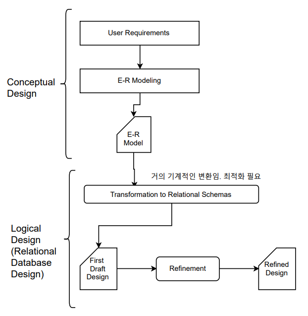

## [목차로](./)


# Relational Database Design

## Data Modeling

이 챕터에서는 Refinement부분을 다룰 것임.

그림에서 E-R Modeling이 Conceptual Design, Relational Data로의 변환이 Logical Design

안좋은 relation을 good form하고 lossless-join decomposition한 relation으로 나누기.

나눌 때 functional dependency를 기반으로 나눔


# Functional Dependencies
`Constraints` on the set of `legal relations` //참고로 cardinality constraints는 entity set에 대한 제한 사항

Functional dependency의 집합을 `F`로 표시함.

key 개념의 일반화
```
functional dependency
α → β holds on R
iff for any legal relation r(R), any two tuple t1, t2 of r,
t1[α]=t2[β] => t1[α]=t2[β]
```

## superkey
K is a superkey for relation schema R iff `K → R`

## candidate key
K is a candidate key for R iff 
```
K → R and
for no α ⊂ K, α → R
```
K의 subset 중에서 R을 결정하는 것이 없다. 그러니까 K가 최소성을 만족한다.

### trivial
```
α → β is trivial if β ⊆ α

ID, name -> ID
name -> name
```

# Lossless-join Decomposition
```
R을 R1, R2로 분해하는것이 lossless join이다 iff
F+중에서 적어도 하나가 다음 조건을 만족하면:
R1 ∩ R2 -> R1 or  // 공통된 attribute가 
R1 ∩ R2 -> R2     // R1 또는 R2에서 superkey 역할을 한다.
```

`F+`(F closure)는 F로 조합 가능한 모든 것들의 집합임.


# Normal Forms
1NF, 2NF, 3NF, BCNF, 4NF, ... 등이 있는데 실제로는 BCNF정도까지 실행함. 우리가 여기서 배울 것은 `1NF`하고 `BCNF`임. 1NF가 2NF를 포함하고, 2NF가 3NF를 포함하고, ...

## First Normal Form (1NF)
```
A relation schema R is in 1NF if the domains of all attributes of R are atomic
```
그러니까 multi-valued attribute하고 composite attribute가 없으면 1NF.

참고로 1NF조차 아니면 relational model이 아님.

## Boyce-Codd Normal Form (BCNF)
```
A relation schema R is in BCNF with respect to a set F of functional dependencies if
for all functional dependenties in F+ of the form
α → β 
where α ⊆ R and β ⊆ R, at least one of the following holds:
α → β is trival or
α is a superkey of β 
``` 

모든 `F+`를 계산할 필요 없이, 주어진 `F`로 `BCNF가 아님`을 판정 할 수 있음. 그러나 `BCNF가 맞다`라는 것을 증명하려면 `F+`를 다 찾아야 함.

예시
```
R = {A, B, C}
F = {A -> B, B -> C}

부분적으로 F+를 계산해보면, 일단 A->A, B->B, C->C는 자명함.
A->ABC, B->BC가 됨.

A->B는 A->ABC에 의해서 A가 R의 superkey가 되니까 이거는 통과.
B->C는 B가 R의 superkey도 아니고, trival한 것도 아님.

따라서 위 예시는 BCNF가 아니다.
```

# Decomposing a Schema into BCNF
α가 superkey가 아닌 경우에 α → β가 non-trivial하면 BCNF를 위반하게 된다. 그럴 경우에 다음과 같이 R을 분해한다. 그러니까 BCNF가 위배되는 원인이 되는 F에 대해서 decomposition을 함.

```
(α ∪ β)
(R - (β - α)) // - α를 하는 이유가 나중에 natural join해야 할 때 lossless해야하므로
```
분해된 2개의 R중 하나에서 공통된 attribute(α)가 superkey 역할을 해야한다.
```
inst_dept(*ID*, name, salary, dept_name, building, budget)
α → β : dept_name -> building, budget 이라고 하면

(α ∪ β):      inst_dept(*dept_name*, building, budget)
(R - (β - α)): inst(*ID*, name, salary, dept_name)
```
```
R(A, B, C, D)
F= {AB -> BC, D->C}

AB->BC를 이용해서 분해

R1(A, B, C)  R2(A, B, D)
F={AB->BC}   F={}

R1에서는 AB->BC에 의해서 AB가 superkey역할을 함. : lossless-join decomposition
R1에서는 AB->BC가 non-trivial이지만 superkey임. BCNF
R2에서는 F가 비었으니까 F+에서는 trivial한 것밖에 없음. 따라서 각각 BCNF 만족함.

그런데 D->C 정보는 사라졌으니, 나중에 application에서 검증, 관리 해줘야 하는 문제가 생김. 이거는 나중에 배움
```


## ER Model and Normalization
E-R diagram이 잘 디자인되었으면, normalization이 필요하지 않음. 그냥 그렇다고.


## F+ 찾기
- if b is subset of a, then a -> b // relexivity
- if a -> b, then ca -> cb // augmentation
- if a -> b and b -> c, then a -> c // transitivity


## [목차로](./)